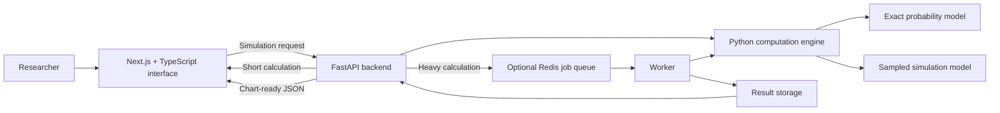
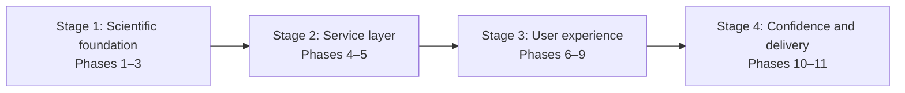
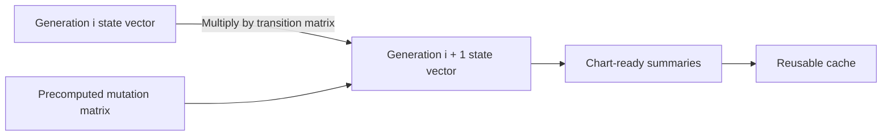
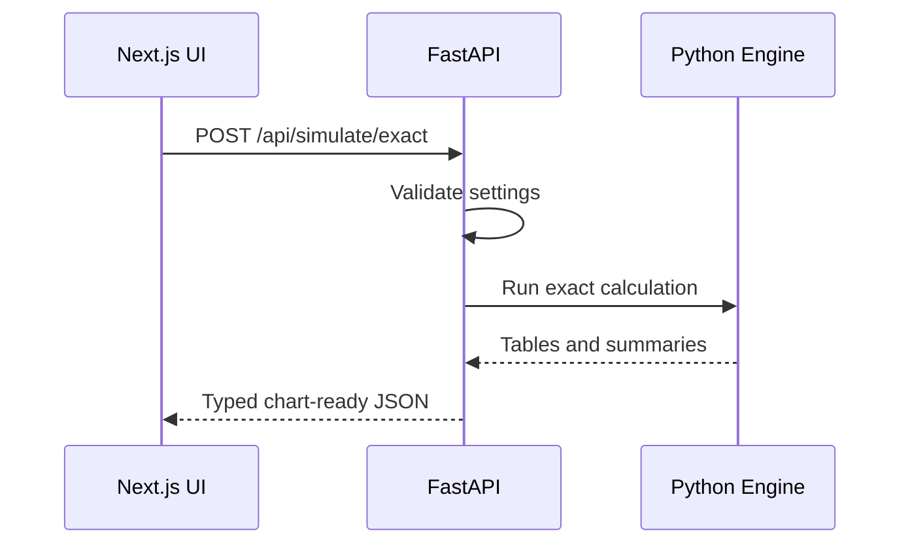
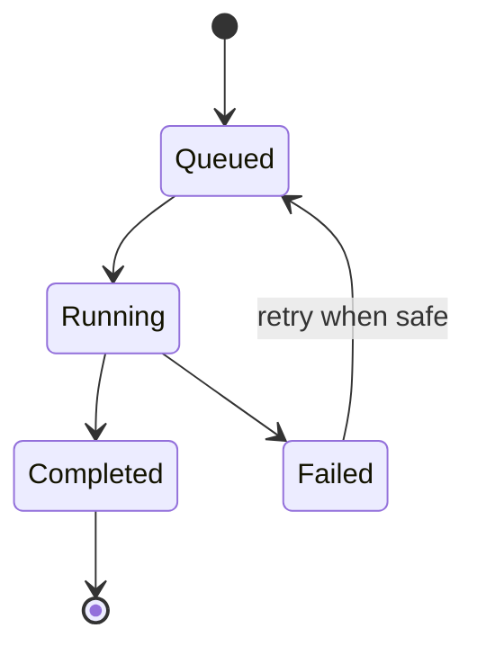
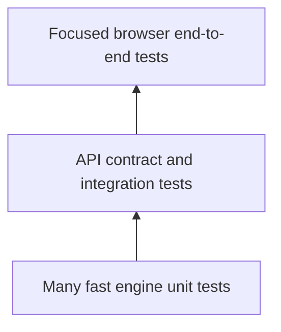
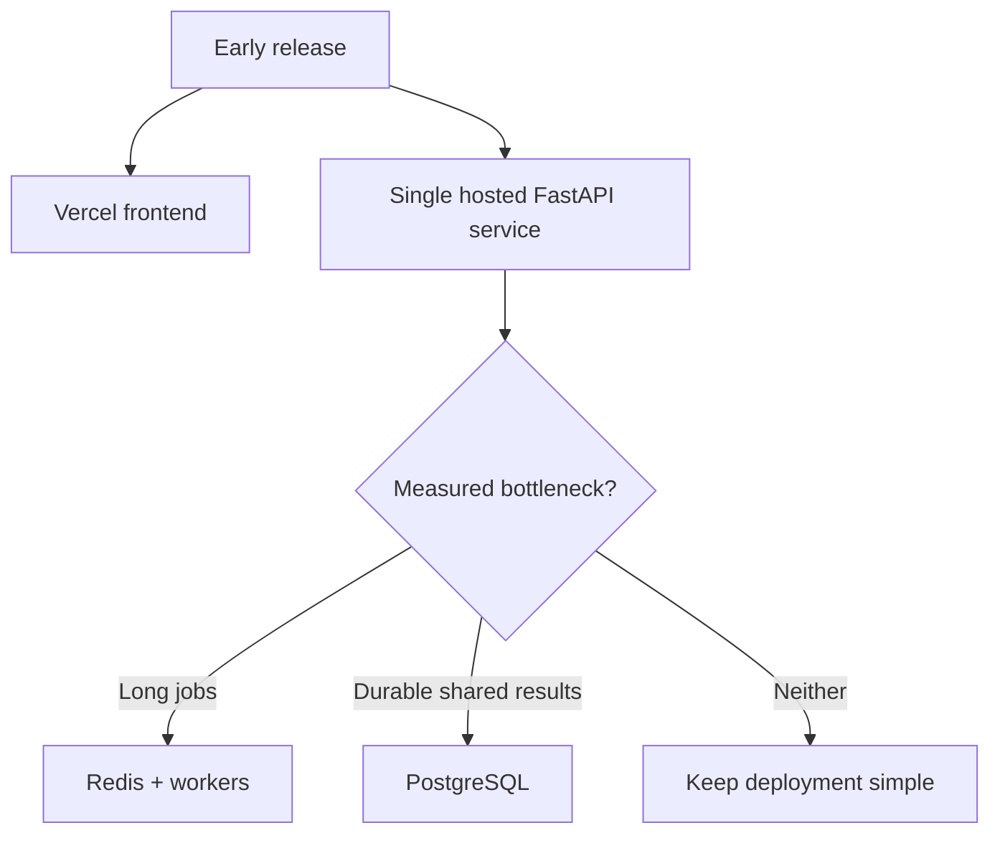
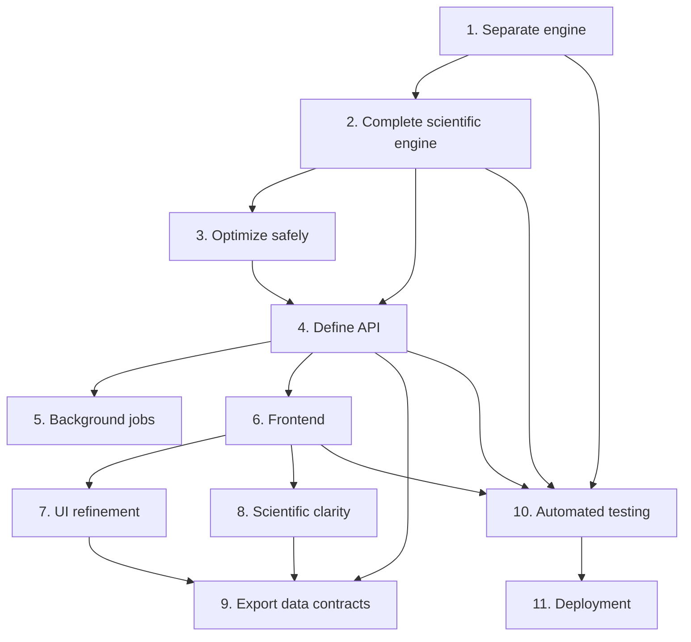

# Future Enhancement Plan — Visual Explanation

## The idea in one sentence

Keep the proven Python biology and probability logic, separate it from Streamlit, expose it through FastAPI, and build a cleaner Next.js interface around it.

This is an evolution of the current project, not a rewrite. Streamlit remains useful as the research version while the new application is developed in controlled stages.

## Canonical project location

The finished application must live under `final code/`. Every source file, test, fixture, asset, configuration file, dependency or lock file, build script, deployment file, worker, migration, or template required to build, test, run, or deploy the web application belongs inside that directory.

Existing root-level code remains the research/reference version until it is deliberately copied into `final code/`. At the end of every stage or phase, the completed application work must be runnable and testable from `final code/` without runtime imports from the workspace root.

## Target architecture

The frontend owns presentation and interaction. FastAPI owns request validation and job coordination. The Python engine remains the single source of truth for biology and mathematics.

## The four-stage journey

| Stage | Main outcome | Why it comes here |
|---|---|---|
| Scientific foundation | Independent, tested, faster Python engine | Every later layer depends on trustworthy calculations |
| Service layer | Stable API and optional background execution | Gives every interface one consistent way to run simulations |
| User experience | Professional analysis workspace and exports | Builds on stable data contracts instead of duplicating logic |
| Confidence and delivery | Automated tests and production deployment | Protects behavior and makes the system reliably usable |

## Key decisions

| Decision | Meaning |
|---|---|
| Do not rewrite in Java | Java would add migration risk without solving the main architecture problem |
| Keep Python for computation | NumPy, pandas, SciPy, and the existing scientific code fit the workload |
| Use exact probability as the primary engine | It is deterministic, scientifically clear, and can use fast matrix operations |
| Keep sampled mode as an experiment | It remains useful for simulation studies but should store summarized counts, not every copy path |
| Use TypeScript for the interface | Next.js gives much better control over charts, layouts, fullscreen views, and interaction |
| Add infrastructure gradually | Redis, workers, and PostgreSQL should appear only when measured workloads require them |

## Stage 1 — Scientific foundation

### Phase 1: Clean the current logic

Move genetic-code data, mutation matrices, exact tracking, sampled tracking, category analysis, and summaries into separate Python modules. Streamlit should call these modules but should not contain scientific calculations itself.

**Result:** the same engine can serve Streamlit, FastAPI, tests, notebooks, or future tools.

**Done when:** calculation modules import without Streamlit, the current interface uses their public functions, and existing results remain unchanged for reference inputs.

### Phase 2: Strengthen the computation

Make the exact probability model the authoritative calculation path. It should produce category counts, survivor fractions, stop percentages, trait and codon survival, convergence information, and comparison results.

Sampled mode remains available, but large runs should update integer counts per generation instead of retaining millions of individual histories.

**Result:** exact and sampled calculations have distinct, clearly documented scientific purposes.

**Done when:** all planned metrics are returned in consistent tables and conservation or probability invariants pass automated checks.

### Phase 3: Optimize performance

Represent evolution as repeated transitions between probability states:

Use NumPy arrays, precomputed matrices, caching, and view-specific calculation. Avoid rebuilding DataFrames unnecessarily and avoid per-copy storage for large sampled simulations.

**Result:** faster runs and lower memory use without changing scientific outputs.

**Done when:** representative benchmarks improve and optimized outputs match trusted baseline results within defined tolerances.

## Stage 2 — Service layer

### Phase 4: Build the FastAPI backend

FastAPI becomes the controlled gateway to the computation engine. Requests carry probabilities, generations, copy counts, codons, traits, and comparison settings. Responses contain clean JSON for charts and tables.

**Result:** presentation code no longer needs direct knowledge of the scientific implementation.

**Done when:** exact and sampled endpoints are validated, documented, tested, and return stable response schemas.

### Phase 5: Add background jobs when necessary

Short calculations can remain synchronous. Heavy calculations should return a job ID, run in a worker, and expose progress and results through the API.

**Result:** the interface stays responsive during expensive simulations.

**Done when:** users can submit, monitor, retrieve, and safely retry a heavy job without losing error information.

## Stage 3 — User experience

### Phase 6: Build the Next.js frontend

Create an analysis-first interface in TypeScript. The opening screen should be the working application—not a marketing page—with clear sections for codon focus, whole-population analysis, probability comparisons, trait drilldown, summary tables, and exports.

**Result:** a maintainable interface that consumes typed API responses and never recalculates biology in the browser.

**Done when:** the main analysis tabs work against the backend and display loading, success, empty, and error states clearly.

### Phase 7: Refine the interface

Add sticky simulation controls, readable chart sizing, non-overlapping legends, scrollable containers, fullscreen sections, side-by-side comparisons, responsive layouts, and a clear DNA or mutation loading state.

**Result:** researchers can inspect dense results without fighting the layout.

**Done when:** core views remain readable at common desktop and mobile sizes and large values do not crash or obscure charts.

### Phase 8: Make the science explicit

Every percentage needs a visible denominator. For example, “trait fraction among survivors” and “stop percentage from a starting trait” answer different questions and must not look interchangeable.

**Result:** metrics are scientifically interpretable without filling the interface with long prose.

**Done when:** every chart and metric has a concise definition, the interface and reports use the same wording, and calculations are linked to tested formulas.

### Phase 9: Add exports and reports

Support chart images, CSV, JSON, Markdown, and PDF. Exports should capture active settings, filters, scientific definitions, and the exact data displayed.

**Result:** analysis can be reproduced, shared, reviewed, and included in research material.

**Done when:** exported values match the active view and reports contain enough configuration information to understand how the result was produced.

## Stage 4 — Confidence and delivery

### Phase 10: Build the testing pyramid

Engine tests protect codon tables, category assignment, transition sums, survival, stops, convergence, sampled conservation, and comparisons. Frontend tests protect loading, controls, tabs, fullscreen behavior, and chart stability.

**Result:** architecture and performance can evolve without silently changing scientific meaning.

**Done when:** important invariants and primary user journeys run automatically and failures clearly identify the affected layer.

### Phase 11: Deploy incrementally

Start with a simple frontend and API deployment. Add workers, Redis, PostgreSQL, or larger cloud infrastructure only after runtime, concurrency, durability, or collaboration requirements justify them.

**Result:** an affordable early system with a clear path to scale.

**Done when:** deployments are reproducible, health checks work, and scaling thresholds are documented rather than guessed.

## Dependency map

The main critical path is **engine separation → scientific correctness → API → frontend → tests → deployment**. Performance, background jobs, interface polish, and reporting can advance around that path once their dependencies are stable.

## Recommended first milestone

The safest first deliverable is not the whole web application. It is a reusable Python engine extracted from the current Streamlit code with baseline tests proving that results did not change.

That milestone creates immediate value:

1. Streamlit becomes easier to maintain.
2. Scientific behavior becomes testable without a browser.
3. Performance work gets measurable baselines.
4. FastAPI can later reuse the same functions.
5. A frontend rewrite cannot accidentally become a scientific rewrite.

## Review questions

When reviewing this canvas, focus on these decisions:

1. Does exact probability correctly deserve priority over sampled simulation?
2. Are any required scientific outputs missing from Phase 2?
3. Should background jobs be part of the first backend release or deferred?
4. Which analysis tab is most important for the first frontend milestone?
5. What result sizes or run times should trigger Redis, workers, or persistent storage?

Annotate any heading, diagram, table row, or sentence that you want changed, then choose **Approve plan** or **Request changes** in the canvas.
