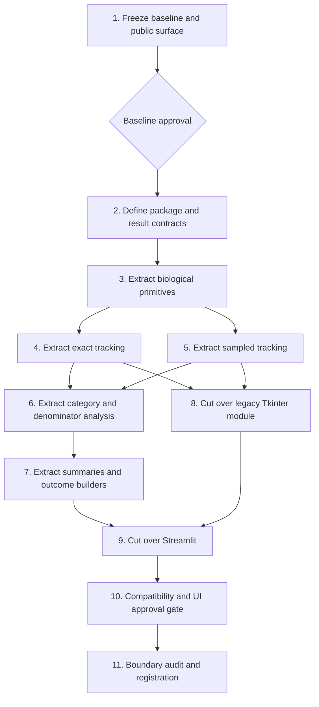

# Blueprint: Phase 1 — Extract a UI-Independent Python Engine

## Blueprint metadata

- **Status:** Complete — Steps 1–11 passed; Step 10 received explicit human approval; Gate 2 handoff prepared on 2026-08-11
- **Scope:** Phase 1 only — scientific engine extraction
- **Objective:** Extract the biological and simulation logic from `category_tracking.py` and `category_tracking_web.py` into a tested, UI-independent Python engine while preserving existing Streamlit behavior, exact-probability results, sampled-simulation semantics, and trusted scientific outputs.
- **Execution mode:** Direct mode. Git preflight fails because this workspace is not a valid repository. GitHub CLI is authenticated but cannot provide branch/PR workflow without a repository.
- **Plan size:** 11 reviewable steps
- **Primary gate:** No behavior-changing optimization, new web architecture, or scientific redefinition is allowed in this phase.
- **Canonical deliverable root:** `final code/`. All implementation, tests, fixtures, application configuration, and runtime artifacts created by this Blueprint belong there.

## Authoritative context

Every cold-start executor must read these five files before its assigned step:

1. `future_enhancement_explained.plan.md` — approved roadmap and Phase 1 definition.
2. `CLAUDE.md` — current stack, entry points, invariants, and repository guardrails.
3. `category_tracking.py` — biological constants, exact and sampled engines, Tkinter UI, and legacy public surface.
4. `category_tracking_web.py` — active Streamlit app, pandas transformations, Plotly builders, and engine consumers.
5. `diagnose_category_tracking_web.py` — frozen compatibility oracle for scientific assertions and Streamlit interactions.

Other large Tkinter/visualization scripts are outside scope unless this Blueprint is formally amended.

The five authoritative context files above are root-level research references. They are read-only inputs for this Blueprint. Phase 1 seeds working copies into `final code/` and performs all implementation there.

## Path resolution rule

- Paths under `engine/`, `tests/`, `.streamlit/`, `category_tracking.py`, `category_tracking_web.py`, and `diagnose_category_tracking_web.py` in step descriptions are relative to `final code/` unless explicitly labeled as root references.
- `plans/` and `CLAUDE.md` remain in the workspace root because they govern work but are not runtime/build inputs.
- After Step 1, run every implementation and verification command with the working directory set to `final code/`.
- Root-level research code may be loaded explicitly for temporary baseline comparisons, but no completed Phase 1 runtime or test may require imports from outside `final code/`.

## Preflight and baseline

- `category_tracking.py` is a roughly 6,400-line mixed module containing biological data, simulation algorithms, charts, and Tkinter UI.
- `category_tracking_web.py` imports that module and also owns pure scientific tables and summaries.
- `run_simulation` returns an undocumented 11-position tuple; `run_experiment` returns a four-position tuple.
- Sampled records use Python's module-level random generator and store every copy path.
- Pytest is absent. Phase 1 uses standard-library `unittest` and the existing diagnostic command.
- On 2026-08-11, `python diagnose_category_tracking_web.py` completed with 17 `PASS` checks. Bare-mode Streamlit warnings were non-failing.
- Observed local versions: Python 3.13.0, Streamlit 1.60.0, pandas 2.2.3, Plotly 6.8.0. These are observations, not project constraints.

## Frozen compatibility contracts

### Exact legacy tuple

| Position | Named field | Required container/meaning |
|---:|---|---|
| 0 | `enc_codon` | `collections.Counter`, accumulated encountered codon weights |
| 1 | `enc_aa` | `collections.Counter`, accumulated encountered amino-acid weights |
| 2 | `enc_codon_cnt` | `collections.Counter`, legacy encountered codon counts |
| 3 | `enc_aa_cnt` | `collections.Counter`, legacy encountered amino-acid counts |
| 4 | `fin_codon` | `collections.Counter`, final surviving codon weights |
| 5 | `fin_aa` | `collections.Counter`, final surviving amino-acid weights |
| 6 | `per_gen_aa` | ordered `list[Counter]` by generation |
| 7 | `start_to_fin` | insertion-ordered mapping of start codon to final `Counter` |
| 8 | `stats` | plain dictionary with current keys and insertion order |
| 9 | `stop_data` | plain dictionary retaining counters, detail records, totals, and key order |
| 10 | `track_data` | plain/nested dictionaries and ordered generation lists with current key order |

### Sampled legacy tuple

| Position | Named field | Required container/meaning |
|---:|---|---|
| 0 | `records` | ordered list of dictionaries with current key order and path semantics |
| 1 | `sample_fin_codon` | `collections.Counter` of surviving final codons |
| 2 | `sample_fin_aa` | `collections.Counter` of surviving final amino acids |
| 3 | `sample_start_to_fin` | insertion-ordered mapping from starting codon to final `Counter` |

Compatibility tests must cover tuple length, concrete container types, dictionary/record key order, signatures/defaults, sparse and empty inputs, and exact values.

## Phase 1 invariants

1. The codon table remains 64 codons: 61 sense codons plus `TAA`, `TAG`, and `TGA` stops.
2. Amino-acid properties, category membership, labels, presets, and mutation mapping remain unchanged.
3. Legacy-vs-new exact results produced in the same Python process must match exactly, including container order and `float.hex()` values. Tolerances are allowed only for reviewed external fixtures intended to survive platform changes.
4. Seeded sampled output and the final `random.getstate()` must match legacy behavior exactly.
5. Streamlit labels, keys, order, defaults, query bindings, cache/RNG effects, chart/table surface, and interactions remain unchanged.
6. `python category_tracking.py` remains supported through a legacy adapter.
7. `diagnose_category_tracking_web.py` remains byte-for-byte unchanged during Phase 1 and continues to pass.
8. Importing `engine` in a fresh process must not import Streamlit, Tkinter, Plotly, PyQt, or other UI frameworks.
9. Fractions and percentages retain their current numerator, denominator, zero-denominator behavior, columns, row order, index, and dtypes.

## Explicit non-goals

- No FastAPI, Next.js, jobs, Redis, PostgreSQL, deployment, or new exports.
- No vectorization, Markov rewrite, caching redesign, pruning, or performance optimization.
- No sampled-count aggregation or removal of per-copy paths.
- No RNG dependency injection or changed seeding contract.
- No UI redesign, entry-point rename, or unrelated legacy-script consolidation.
- No new probability-validation behavior; the negative-input gap remains documented for a later correctness change.

## Target structure

```text
final code/
  README.md
  .streamlit/
    config.toml
  engine/
    __init__.py
    genetic_code.py
    mutation_matrix.py
    models.py
    exact_tracking.py
    sampled_tracking.py
    category_analysis.py
    summaries.py
  tests/
    __init__.py
    compat/
      __init__.py
      diagnose_category_tracking_web_phase1_baseline.py
    fixtures/
      phase1_scientific_baseline.json
      phase1_streamlit_surface.json
    test_baseline_behavior.py
    test_engine_boundaries.py
    test_genetic_code.py
    test_exact_tracking.py
    test_sampled_tracking.py
    test_category_analysis.py
    test_summaries.py
    test_streamlit_surface.py
  category_tracking.py
  category_tracking_web.py
  diagnose_category_tracking_web.py  # frozen compatibility diagnostic
plans/
  phase-1-execution-log.md
```

Pandas is permitted in analysis/summary modules. UI frameworks and chart libraries are not.

## Migration inventory

| Current source | Target | Preservation requirement |
|---|---|---|
| Codon/amino-acid constants and grouping helpers in `category_tracking.py` | `engine/genetic_code.py` | Exhaustive value and ordering equality; UI colors stay outside engine |
| `build_substitution_matrix` and probability presets | `engine/mutation_matrix.py` | Exact mapping/order equality |
| `run_simulation` | `engine/exact_tracking.py` | Exact same-process `float.hex()` and container-order equality |
| `run_experiment` | `engine/sampled_tracking.py` | Exact records, aggregates, and final RNG-state equality |
| Category/all-population series pairs | `engine/category_analysis.py` | DataFrame columns, index, dtypes, row order, and values |
| Starting-trait survival/stop series pairs | `engine/category_analysis.py` | Same start-population basis and zero handling |
| Trait codon/AA survival series and `codons_for_trait` | `engine/category_analysis.py` | Same grouping, ordering, and empty behavior |
| Surviving fractions, survival balance, trait summary | `engine/category_analysis.py` | Denominator matrix below |
| Stop series, convergence, exact no-more-change | `engine/summaries.py` | Same tolerance/status text and generation labeling |
| `all_codon_no_more_change` | `engine/summaries.py` | Same rows, ordering, and shared exact source behavior |
| `codon_to_codon_histogram` | Split pure outcome-table builder into `engine/summaries.py`; keep Plotly figure builder in web | Exact generation/start/stop outcome data |
| Inline denominator/metric calculations in render panels | Named pure helpers in `engine/summaries.py` | No scientific arithmetic remains embedded in render functions |
| `parse_prob` | Web owns its text-input adapter; Tkinter retains its compatibility parser | Final web module must not import `category_tracking` for parsing |

## Denominator contract matrix

Step 1 must record observed schemas and Step 6 must encode these contracts explicitly.

| Output | Numerator | Denominator/basis | Zero behavior |
|---|---|---|---|
| Surviving category fraction | Surviving weight/count in one category at a generation | Sum of all non-stop survivors at that generation | Fraction `0.0` when survivor total is zero |
| Starting-trait stop percentage | Cumulative stopped weight/count from codons that started in the trait | Initial copies/weight belonging to that starting trait | `0.0` when starting total is zero |
| Survival balance | Surviving weight/count | Explicit total starting copies; stopped is `max(0, start - surviving)` | Preserve current clipping |
| Trait codon stop fraction | Starting copies per codon minus final survivors | Copies per starting codon | `0.0` when copies per codon is zero |
| Trait codon/AA survival | Survivors originating from the selected starting trait/codon/AA | Absolute surviving count/weight, not a normalized fraction | Empty schema/order must remain stable |
| No-more-change, count basis | Category-count vector | All current and later generations within tolerance `1.0` | Preserve `all stopped` status text |
| No-more-change, fraction basis | Surviving category fractions | All current and later generations within `alpha` | Preserve current zero-survivor vector behavior |

## Dependency graph



Steps 4 and 5 are logically parallel because they own separate files. In this invalid-Git shared workspace they must execute serially unless isolated worktrees or separate copies are established. No simultaneous writers or verification runs are allowed in direct mode.

## Direct-mode safety and execution log

Create `plans/phase-1-execution-log.md` in Step 1. Before every step it must record:

- planned created/modified files;
- whether each file existed;
- SHA-256 for existing files;
- UTC timestamp;
- unique backup path for each existing file;
- exact verification output and status;
- any plan mutation and approver.

For any step modifying existing files, create a timestamped directory under the OS temporary directory, for example `phase1-engine-extraction/step-08-YYYYMMDD-HHmmss`. Copy files with literal paths and record `Get-FileHash -Algorithm SHA256` before editing. Rollback restores only recorded pre-existing files with `Copy-Item -LiteralPath <recorded-backup> -Destination <recorded-target> -Force`. Newly created files may be removed only when their resolved paths match the step manifest; never use a recursive broad delete. Keep all backups until Phase 1 approval, then ask before removing them.

After rollback, rerun the previous completed wave's verification commands. Repairing or initializing Git is recommended before implementation but remains outside this code-change scope.

All backup manifests must identify `final code/` targets explicitly. Root-level research files are never rollback targets because this Blueprint does not modify them.

## Verification working-directory convention

The first root baseline command in Step 1 runs from the workspace root. After the working copies are seeded, all fenced verification commands run from `final code/`. Executors must set the working directory explicitly rather than relying on ambient shell state.

---

## Step 1 — Freeze baseline behavior, public surface, and UI manifest

- **Model tier:** Strongest
- **Depends on:** None
- **Touched files:** New files under `final code/` plus the root execution log; root research files remain unchanged

### Context brief

The existing diagnostic is green but is not a complete preservation oracle. Freeze scientific expectations, module signatures/container shapes, RNG state, and the Streamlit surface before production code changes. Use `unittest`; pytest is unavailable.

### Tasks

1. From the workspace root, run the existing diagnostic and record the 17-pass reference result.
2. Create the execution log and record this step's file manifest.
3. Copy root `category_tracking.py`, `category_tracking_web.py`, `diagnose_category_tracking_web.py`, and `.streamlit/config.toml` into matching locations under `final code/`; record root/copy SHA-256 equality before any edit.
4. Copy the diagnostic again to `final code/tests/compat/diagnose_category_tracking_web_phase1_baseline.py`; record SHA-256 equality among all three copies. Never edit the root diagnostic or frozen compatibility copy during Phase 1.
5. Inventory all in-scope public module names, callable signatures/defaults, tuple lengths, container types, nested/record key order, and empty/sparse input behavior.
6. Add compact, human-reviewed exact fixtures for single-codon, all-codon, stop, survival, category, and convergence cases. External fixtures may use stated tolerances; same-process legacy/new comparisons later must be exact.
7. Add sampled fixtures with nonuniform matrices, early stops, multiple starting codons, sparse/zero weights, zero generations, and consecutive calls.
8. Capture an AppTest manifest for widget type/order/label/key/default/value, segmented controls, select boxes, number inputs, major chart/table counts/titles, and query-binding-visible behavior.
9. Add direct `run_cached` characterization for cache miss/hit output compatibility and RNG-state effects.
10. Tests must never regenerate fixtures automatically.
11. Do not modify the root research files.

### Verification

```powershell
python -m unittest discover -s tests -p "test_*.py"
python diagnose_category_tracking_web.py
python -m tests.compat.diagnose_category_tracking_web_phase1_baseline
```

### Exit criteria

- The root diagnostic, `final code/diagnose_category_tracking_web.py`, and the frozen compatibility copy have identical SHA-256 hashes and produce the original 17 passes.
- `streamlit run category_tracking_web.py` works with `final code/` as the working directory.
- The reviewed fixture and UI manifests can detect tuple swaps, container/order drift, RNG-state drift, denominator drift, and UI surface drift.
- Human approval of the baseline is recorded before Step 2.

### Rollback

Remove only new files listed in this step's manifest after verifying their resolved paths. Production remains untouched.

### Handoff

Pass Step 2 the approved tuple map, public-signature inventory, scientific fixtures, UI manifest, and exact-vs-tolerance comparison rules.

---

## Step 2 — Define package boundaries and named result contracts

- **Model tier:** Strongest
- **Depends on:** Step 1 approval
- **Touched files:** `engine/__init__.py`, `engine/models.py`, boundary/contract tests

### Context brief

Create minimal named models matching the frozen 11- and four-position mappings. New APIs use named fields; tuple conversion exists only for legacy adapters. No production consumer changes yet.

### Tasks

1. Create the `engine` package with a small explicit public surface.
2. Define `ExactSimulationResult` and `SampledSimulationResult` plus only necessary typed aliases.
3. Implement explicit `to_legacy_tuple()` conversions following the tables above.
4. Test length, exact field position, concrete container types, nested key order, record key order, signatures/defaults, and empty/sparse values.
5. In fresh subprocess tests, prove importing `engine` does not load UI frameworks.
6. Do not invent speculative domain abstractions or wire consumers yet.

### Verification

```powershell
python -m unittest discover -s tests -p "test_*.py"
python -c "import sys, engine; assert not ({'streamlit','tkinter','plotly','PyQt5'} & set(sys.modules))"
python diagnose_category_tracking_web.py
```

### Exit criteria

- Every legacy position maps to exactly one documented field.
- Conversion preserves concrete types and order.
- UI independence is proven in a fresh process.

### Rollback

Restore/remove only files in this step's execution-log manifest.

### Handoff

Provide Step 3 the finalized model names, tuple contract, and import-boundary rule.

---

## Step 3 — Extract biological definitions and mutation primitives

- **Model tier:** Strongest
- **Depends on:** Step 2
- **Touched files:** `engine/genetic_code.py`, `engine/mutation_matrix.py`, focused tests

### Context brief

Copy/adapt scientific constants and helpers into the engine without editing either production module. Colors, widgets, and text parsing remain outside the engine until consumer cutover.

### Tasks

1. Extract bases, stops, codon table, amino-acid names/properties, valid codons, category identifiers/labels, presets, grouping helpers, and substitution construction.
2. Keep UI colors and `parse_prob` out of engine scientific modules.
3. Preserve mapping values and insertion order exactly.
4. Compare every constant/helper exhaustively with the legacy module.
5. Test 64/61/3 codon counts, category coverage, preset values, substitution mappings, and row totals.
6. Do not change negative-input behavior.

### Verification

```powershell
python -m unittest discover -s tests -p "test_genetic_code.py"
python -m unittest discover -s tests -p "test_*.py"
python diagnose_category_tracking_web.py
```

### Exit criteria

- Extracted values and order match legacy exactly.
- Engine primitives contain no UI metadata/imports.
- Production consumers are untouched.

### Rollback

Restore/remove only files listed for Step 3.

### Handoff

Steps 4 and 5 use these primitives but must not modify legacy consumers.

---

## Step 4 — Extract exact probability tracking

- **Model tier:** Strongest
- **Depends on:** Step 3
- **Logically parallel with:** Step 5; execute serially in current direct mode
- **Touched files:** `engine/exact_tracking.py`, `tests/test_exact_tracking.py`

### Context brief

Move the exact algorithm without optimizing it. Preserve every iteration and accumulation order because same-process output equality is bit-sensitive.

### Tasks

1. Copy/adapt `run_simulation` to use engine primitives and return `ExactSimulationResult`.
2. Preserve iteration order across starts, generations, current codons, positions, substitutions, dictionary creation, and counters.
3. Compare all same-process legacy/new floats using `float.hex()`, and require exact nested container/key-order equality.
4. Use tolerances only against explicitly marked external fixtures.
5. Cover default/sparse/empty weights, zero generations, stops, tracking maps, stats, and legacy conversion.
6. Do not edit `category_tracking.py`, `category_tracking_web.py`, `diagnose_category_tracking_web.py`, or shared files owned by Step 5.

### Verification

```powershell
python -m unittest discover -s tests -p "test_exact_tracking.py"
python -m unittest discover -s tests -p "test_*.py"
python diagnose_category_tracking_web.py
```

### Exit criteria

- Same-process legacy/new results are exact, including `float.hex()` and order.
- Conservation and external fixture assertions pass.
- No consumer uses the new engine yet.

### Rollback

Restore/remove only Step 4 files, then rerun Step 3 verification.

### Handoff

Provide Step 6 and Step 8 the exact API and equality evidence.

---

## Step 5 — Extract sampled-copy tracking

- **Model tier:** Strongest
- **Depends on:** Step 3
- **Logically parallel with:** Step 4; execute serially in current direct mode
- **Touched files:** `engine/sampled_tracking.py`, `tests/test_sampled_tracking.py`

### Context brief

Preserve module-level RNG behavior, draw order, record schema, and full paths. RNG redesign and memory optimization are deferred.

### Tasks

1. Copy/adapt `run_experiment` to return `SampledSimulationResult`.
2. For each comparison, capture one initial `random.getstate()`, run legacy and record output/final state, restore the initial state, run new code, and require exact output plus final-state equality.
3. Cover nonuniform matrices, zero-probability alternatives, early stops, multiple starts, sparse/zero weights, zero generations, and consecutive unseeded calls.
4. Preserve mutation-position/base-choice calls, copy numbering, record key order, `stop_gen`, final values, and paths.
5. Do not inject a new RNG or remove path storage.
6. Do not edit production consumers or shared files owned by Step 4.

### Verification

```powershell
python -m unittest discover -s tests -p "test_sampled_tracking.py"
python -m unittest discover -s tests -p "test_*.py"
python diagnose_category_tracking_web.py
```

### Exit criteria

- Outputs and final RNG state match exactly for all reviewed cases.
- Record/container schemas and order remain exact.
- No consumer uses the new engine yet.

### Rollback

Restore/remove only Step 5 files, then rerun Step 3 verification.

### Handoff

Provide Step 6 and Step 8 the sampled API and RNG-state evidence.

---

## Step 6 — Extract category, trait, and denominator analysis

- **Model tier:** Strongest for denominator review
- **Depends on:** Steps 4 and 5
- **Touched files:** `engine/category_analysis.py`, `tests/test_category_analysis.py`

### Context brief

Copy/adapt the pure category, population, trait, fraction, balance, and trait-summary functions listed in the migration inventory. Do not edit `category_tracking_web.py`, `category_tracking.py`, `diagnose_category_tracking_web.py`, or `engine/__init__.py` in this step; legacy functions must remain active for side-by-side comparison.

### Tasks

1. Implement the category/trait series and denominator functions in `engine.category_analysis` against named results.
2. Encode every row of the denominator contract matrix, including zero behavior.
3. Compare legacy/new DataFrames for column order, index, dtypes, categorical order, row order, values, and empty schemas.
4. Port applicable diagnostic assertions into focused tests without changing the frozen diagnostic.
5. Keep Plotly, Streamlit, Tkinter, CSS, colors, and render code out.

### Verification

```powershell
python -m unittest discover -s tests -p "test_category_analysis.py"
python -m unittest discover -s tests -p "test_*.py"
python -c "import sys; import engine.category_analysis; assert not ({'streamlit','tkinter','plotly','PyQt5'} & set(sys.modules))"
python diagnose_category_tracking_web.py
```

### Exit criteria

- All listed analysis families match legacy data and schema exactly.
- Denominator and zero cases are explicit and tested.
- Legacy web functions remain untouched for comparison.

### Rollback

Restore/remove only Step 6 files, then rerun Steps 4–5 verification.

### Handoff

Provide Step 7 with the named analysis API and schema evidence.

---

## Step 7 — Extract convergence, stop, and outcome summaries

- **Model tier:** Strongest
- **Depends on:** Step 6
- **Touched files:** `engine/summaries.py`, `tests/test_summaries.py`

### Context brief

Copy/adapt pure stop series, convergence/no-more-change logic, all-codon summaries, outcome-table calculation, and inline scientific arithmetic identified in the migration inventory. Figure creation remains in Streamlit.

### Tasks

1. Implement stop and no-more-change functions with identical tolerances, labels, ordering, and all-stopped behavior.
2. Split `codon_to_codon_histogram` into a pure outcome-table builder and a web figure builder; create only the pure builder now.
3. Extract inline population/trait denominator and metric calculations from render panels into named pure helpers.
4. Compare DataFrame schema/order/dtypes/values and status strings exactly.
5. Keep both production modules and the frozen diagnostic untouched.

### Verification

```powershell
python -m unittest discover -s tests -p "test_summaries.py"
python -m unittest discover -s tests -p "test_*.py"
python -c "import sys; import engine.summaries; assert not ({'streamlit','tkinter','plotly','PyQt5'} & set(sys.modules))"
python diagnose_category_tracking_web.py
```

### Exit criteria

- Every migration-inventory summary has a pure tested target.
- No Plotly figure is created by engine code.
- Legacy web functions remain available until Step 9.

### Rollback

Restore/remove only Step 7 files, then rerun Step 6 verification.

### Handoff

Provide Step 9 a complete old-symbol-to-new-symbol cutover table.

---

## Step 8 — Cut over the legacy Tkinter module through adapters

- **Model tier:** Strongest
- **Depends on:** Steps 4 and 5
- **Touched files:** `category_tracking.py` and explicitly listed adapter tests/files only

### Context brief

This is the first destructive extraction step inside the deliverable copy. Back up and hash `final code/category_tracking.py`. Convert that file into a compatibility boundary that re-exports scientific definitions and converts named engine results into the exact legacy tuples. The root research file remains unchanged. Tkinter UI/charts remain local.

### Tasks

1. Freeze the touched-file manifest and create recorded backups before editing.
2. Replace biological definitions/helpers with engine imports or compatibility re-exports; keep UI colors locally.
3. Replace exact/sampled bodies with thin adapters and exact legacy tuple conversion.
4. Remove only duplicated blocks already proven equivalent.
5. Preserve every in-scope public name/signature/default captured in Step 1.
6. Confirm import does not launch a window; manually smoke-launch the Tkinter app only when an interactive desktop is available.
7. Do not edit the web app or frozen diagnostic.

### Verification

```powershell
python -m unittest discover -s tests -p "test_*.py"
python -c "import category_tracking as c; assert len(c.CODON_TABLE) == 64 and len(c.VALID_CODONS) == 61"
python diagnose_category_tracking_web.py
python -m tests.compat.diagnose_category_tracking_web_phase1_baseline
```

### Exit criteria

- Public surface, signatures, tuples, types, order, and values match the Step 1 inventory.
- Duplicate biological/simulation implementations are removed from `category_tracking.py`.
- Tkinter does not enter `engine`.
- Both diagnostic oracles remain hash-identical and green.

### Rollback

Restore all pre-existing Step 8 files from recorded backups, remove only manifest-listed new files, and rerun Step 7 verification.

### Handoff

Step 9 must import new scientific work from `engine`, never extend compatibility wrappers.

---

## Step 9 — Cut over Streamlit to named engine APIs

- **Model tier:** Strongest
- **Depends on:** Steps 7 and 8
- **Touched files:** `category_tracking_web.py` and explicit web-focused tests only; frozen diagnostic remains untouched

### Context brief

Back up `final code/category_tracking_web.py`, then replace Tkinter-module imports, tuple indexes, and local pure analysis with engine APIs. Preserve old web helper symbols through imported aliases where compatibility requires them. The root research file remains unchanged. The web owns text probability parsing; chart and UI code stay in the web module.

### Tasks

1. Freeze touched-file ownership and create recorded backups.
2. Make `run_cached` call named engine APIs and replace every tuple index with a named field.
3. Import analysis/summaries from engine and retain compatibility aliases for symbols used by the frozen diagnostic.
4. Split the histogram function so only Plotly rendering remains in web code.
5. Move/retain `parse_prob` as a web input adapter so final web code has no `category_tracking` import.
6. Remove local pure scientific implementations only after side-by-side tests pass.
7. Preserve widget/cache/query/chart behavior; do not edit `diagnose_category_tracking_web.py`.
8. Search for biological tables, simulation loops, tuple indexing, and scientific denominator arithmetic remaining in the web file.

### Verification

```powershell
python -m unittest discover -s tests -p "test_*.py"
python diagnose_category_tracking_web.py
python -m tests.compat.diagnose_category_tracking_web_phase1_baseline
python -c "import category_tracking_web"
```

### Exit criteria

- Web imports scientific APIs from `engine`, not `category_tracking`.
- No simulation algorithm or scientific table remains in web code.
- Compatibility helper imports keep the frozen diagnostic green.
- All three diagnostic copies remain byte-identical to their Step 1 hashes.

### Rollback

Restore all Step 9 existing files from recorded backups, remove only manifest-listed new files, and rerun Step 8 verification.

### Handoff

Provide Step 10 the final import map, search results, full test output, and cache behavior notes.

---

## Step 10 — Prove compatibility and obtain UI approval

- **Model tier:** Strongest
- **Depends on:** Step 9
- **Touched files:** UI/compatibility tests and execution log only; no production changes unless this step reopens Step 9

### Context brief

This is a validation gate, not another refactor. Compare the frozen Streamlit surface manifest, cache behavior, charts/tables, and human-visible workflows. If anything differs, reopen and roll back Step 9 instead of weakening expectations.

### Tasks

1. Compare widget type/order/label/key/default/value and query-visible behavior against the frozen manifest.
2. Compare major chart/table counts, titles, traces/columns, and representative data.
3. Test `run_cached` miss/hit equality, return model compatibility, and documented RNG-state effects.
4. Run both unchanged diagnostic scripts and all focused tests.
5. Perform the recorded human checklist: both workspaces; user/preset/compare; sampled/exact; codon/trait selection; no-more-change basis/alpha; invalid inputs; loading/fullscreen behavior where testable.
6. Record approval or request changes. Never edit expected fixtures merely to accept new output.

### Verification

```powershell
python -m unittest discover -s tests -p "test_*.py"
python diagnose_category_tracking_web.py
python -m tests.compat.diagnose_category_tracking_web_phase1_baseline
```

### Exit criteria

- Scientific, compatibility, UI-surface, cache, and RNG checks pass.
- Human approval is recorded.
- No fixture, frozen oracle, or tolerance was weakened without a separately approved plan mutation.

### Rollback

On failure, restore Step 9 from its recorded backups and rerun Step 8 verification. Do not patch around a failed preservation check in Step 10.

### Handoff

Provide Step 11 the approval record and immutable verification outputs.

---

## Step 11 — Audit boundaries, document, and register Phase 1

- **Model tier:** Strongest
- **Depends on:** Step 10 approval
- **Touched files:** Engine documentation, `CLAUDE.md`, Blueprint status/execution log, boundary tests

### Context brief

Close Phase 1 only when the engine boundary is enforceable and understandable to a cold-start agent. This step adds no features.

### Tasks

1. Document modules, public APIs, result models, exact comparison policy, RNG semantics, denominators, and verification commands.
2. Update `CLAUDE.md` with the implemented structure and this Blueprint path.
3. Audit for duplicate codon tables, property tables, exact/sample loops, tuple indexes, scientific web arithmetic, import cycles, and UI imports.
4. Run boundary assertions only in fresh subprocesses so prior Tkinter/Streamlit imports cannot contaminate results.
5. Verify the frozen diagnostic hashes still match Step 1.
6. Record deferred work: validation changes, optimization, sampled aggregation, API/frontend/jobs/persistence/deployment.
7. Mark this Blueprint `Complete` only after all exit criteria pass.

### Verification

```powershell
python -m unittest discover -s tests -p "test_*.py"
python diagnose_category_tracking_web.py
python -m tests.compat.diagnose_category_tracking_web_phase1_baseline
python -c "import sys, engine; forbidden={'streamlit','tkinter','plotly','PyQt5'}; assert not forbidden.intersection(sys.modules)"
```

Do not use `compileall` as a completion gate; it creates `__pycache__` artifacts that complicate direct-mode manifests.

### Exit criteria

- Engine is the single scientific source of truth within the specified files.
- Named results are standard; tuples exist only at compatibility boundaries.
- Same-process exact equality and sampled output/final-RNG equality pass.
- Streamlit and Tkinter behavior remains supported.
- Both frozen diagnostics and all focused tests pass.
- Documentation accurately separates completed and deferred phases.
- The Phase 1 app and tests run with `final code/` as the working directory and do not import runtime application code from the workspace root.

### Rollback

Documentation changes can be restored independently. Any behavior failure reopens the responsible implementation step; never mask it in docs/tests.

### Handoff

Phase 2 must build only on named engine APIs and must not optimize legacy adapters.

---

## Adversarial review checklist

1. Can a fresh agent execute each step from its brief and authoritative files?
2. Are touched files frozen before each direct-mode step?
3. Are frozen oracles and UI manifests independent of the new implementation?
4. Is exact equality bit-level in the same environment?
5. Are sampled output and final RNG state both exact?
6. Are legacy signatures, concrete types, nested order, and defaults preserved?
7. Are DataFrame columns/index/dtypes/order/empty schemas preserved?
8. Are all denominator contracts and zero behaviors explicit?
9. Is Streamlit surface/cache/query behavior actually checked?
10. Are UI frameworks absent from engine imports in a fresh process?
11. Are direct-mode concurrency races prohibited?
12. Has work stayed inside Phase 1?

## Anti-pattern catalog

- Big-bang extraction or consumer cutover before side-by-side equivalence.
- Self-regenerating golden fixtures or editing the frozen diagnostic oracle.
- Float tolerances masking same-process accumulation-order drift.
- Output equality without final RNG-state equality.
- Container, key-order, DataFrame dtype/index, or empty-schema drift.
- UI imports, presentation colors, charts, or widget code entering engine modules.
- Scientific tables/algorithms remaining authoritative in both legacy and engine modules.
- Denominator or zero-case drift hidden behind similar displayed numbers.
- Import cycles between engine, Tkinter, and Streamlit adapters.
- Cache serialization/key/RNG behavior changing during consumer migration.
- Concurrent writers or verification races in the shared direct-mode workspace.
- Weakening tests/tolerances after a failure instead of reopening the responsible step.
- Premature optimization, entry-point moves, or unrelated legacy cleanup.

## Plan mutation protocol

Record every mutation in `plans/phase-1-execution-log.md` with UTC date, reason, dependency/touched-file impact, and approver.

- **Split:** Preserve original exit criteria across child steps and update edges.
- **Insert:** Only for a blocking prerequisite inside the Phase 1 objective.
- **Reorder:** Only when dependencies and touched-file ownership remain valid.
- **Skip:** Only with evidence that all tasks and verification already pass.
- **Abandon:** Restore the affected manifest, verify the prior wave, and request a scientific/architectural decision.
- **Scope expansion:** Optimization, new API/UI, sampled-memory redesign, and unrelated legacy consolidation require another Blueprint.

## Phase 1 definition of done

- `engine` owns biological definitions, mutation construction, exact tracking, sampled tracking, category analysis, and pure summaries for the specified files.
- New APIs use named results; legacy tuple shapes exist only at adapters.
- Importing engine in a fresh process loads no UI framework.
- Exact results and seeded sampled behavior/RNG state match legacy contracts.
- Streamlit retains its frozen surface and both unchanged diagnostic scripts pass.
- Tkinter remains supported through `category_tracking.py` adapters.
- Documentation and `CLAUDE.md` describe the implemented boundary.
- Deferred work remains explicitly deferred.
- Application code, tests, fixtures, theme/configuration, and every Phase 1 runtime dependency live inside `final code/`; the app runs without root-level runtime imports.

## Registration

- **Plan:** `plans/phase-1-extract-ui-independent-engine.md`
- **Execution log:** `plans/phase-1-execution-log.md` (created during Step 1)
- **Index:** Add this plan path to `CLAUDE.md` only after approval re-check.
- **Next action after approval:** Execute Step 1 only and stop at its human baseline gate.

## Pre-execution amendment log

| Date | Amendment | Reason | Dependency impact | Authority |
|---|---|---|---|---|
| 2026-08-11 | Root all application deliverables under `final code/`; keep existing root code as research/reference input | User-established mandatory project organization rule | Step 1 seeds self-contained working copies; Steps 2–11 execute inside `final code/`; phase exit forbids runtime/test imports from root | User instruction |
