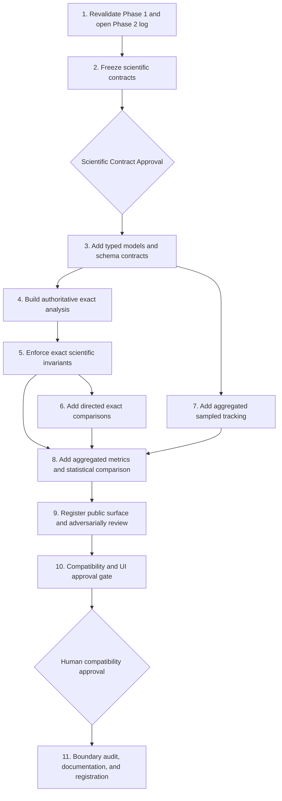

# Blueprint: Phase 2 — Strengthen the Computation

## Blueprint metadata

- **Status:** Complete
- **Scope:** Phase 2 only — authoritative exact analysis, consistent scientific metrics, and memory-safe aggregated sampling
- **Objective:** Make exact probability the authoritative deterministic scientific path for category counts, survivor fractions, stop percentages, trait survival, codon survival, amino-acid survival, convergence, stop outcomes, and comparisons; retain detailed sampled paths as a frozen experimental compatibility mode and add an explicit aggregated sampled mode for large runs.
- **Execution mode:** Direct mode. The workspace is not a valid Git repository; GitHub CLI authentication exists but no branch, commit, or PR workflow is available. Do not initialize, repair, or modify Git.
- **Size classification:** Large, cross-cutting scientific change — 11 serialized implementation steps, two human approval gates, one final handoff gate.
- **Risk classification:** High. The main risks are denominator drift, floating-point-order drift, sampled RNG ambiguity, inconsistent table schemas, hidden UI regressions, and accidental Phase 3 optimization.
- **Canonical implementation root:** `final code/`. Only this Blueprint and `plans/phase-2-execution-log.md` may live outside it.
- **Frozen predecessor:** Phase 1 is complete and approved. Its fixtures, diagnostics, legacy signatures, exact outputs, detailed sampled paths, RNG behavior, Streamlit surface, and Tkinter adapter are immutable compatibility constraints.
- **Completion registration:** Phase 2 Step 10 was explicitly approved and Step 11 prepared the Gate 2 handoff. Gate 2 handoff ready; no Git action was taken because repository metadata is invalid.

## Authoritative context and cold-start rule

Before any Phase 2 implementation step, the executor must read completely:

1. `CLAUDE.md`
2. `future_enhancement_explained.plan.md`
3. `plans/phase-1-extract-ui-independent-engine.md`
4. `plans/phase-1-execution-log.md`
5. `plans/phase-2-strengthen-computation.md`
6. `plans/phase-2-execution-log.md`, once Step 1 creates it
7. `final code/CLAUDE.md`
8. `final code/.ai-style-rules.md`
9. `final code/README.md`
10. `final code/engine/README.md`

The executor must then read the step-specific files named in that step's context brief. Root `category_tracking.py`, `category_tracking_web.py`, and `diagnose_category_tracking_web.py` are read-only research references. Completed code and tests must not import them.

Before every application-code edit, state the required style-compliance declaration. Name the applicable golden exemplar and explicitly affirm these DONTs: no duplicated biological tables or simulation algorithms, no scientific arithmetic in render functions, no positional tuple indexing in new APIs/consumers, no changed denominators or floating-point/RNG order in frozen APIs, no UI imports in the engine, no root runtime imports, and no application files outside `final code/`.

## Phase 1 fixed point

The implementation must preserve all of the following:

- `run_simulation(...) -> ExactSimulationResult` and its exact historical accumulation order and `to_legacy_tuple()` representation.
- `run_experiment(...) -> SampledSimulationResult`, including module-global `random`, start-codon/copy/generation iteration, `randint` then `choices`, early stops, record/path/key order, copy numbering, consecutive-call behavior, and final `random.getstate()`.
- All existing compatibility signatures, defaults, concrete containers, dictionary/key order, DataFrame schemas/dtypes/indexes/empty results, Streamlit cache behavior, widgets, query bindings, charts, tables, errors, accessibility, visual identity, and Tkinter behavior.
- The three byte-identical diagnostic copies and the two Phase 1 JSON fixtures.
- Root research hashes and the rule that final runtime imports resolve under `final code/`.

The exact algorithm is not rewritten in Phase 2. The new authoritative layer calls it and derives explicit scientific result tables from its named output. Vectorization, transition matrices, NumPy/SciPy optimization, pruning, caching redesign, and view-specific performance work belong to Phase 3.

## Current API sufficiency and Phase 2 additions

### Existing Phase 1 APIs that remain sufficient

- `engine.genetic_code` is the sole biological definition source.
- `engine.mutation_matrix.build_substitution_matrix` remains the sole substitution-map constructor.
- `engine.exact_tracking.run_simulation` remains the trusted exact propagation primitive.
- `engine.sampled_tracking.run_experiment` remains the frozen detailed sampled primitive.
- Existing category/summary functions remain compatibility-preserving building blocks where their denominator inputs are complete.
- `ConvergenceResult` and `NoMoreChangeResult` remain the named compatibility results for their existing algorithms.

### New Phase 2 APIs required

Names are finalized at the Scientific Contract Gate, but the approved implementation must provide these responsibilities without positional tuples:

- `run_exact_analysis(...) -> ExactAnalysisResult`: calls `run_simulation` once, retains the input starting weights, and exposes canonical metric tables through named fields or named scoped query functions.
- `build_exact_analysis(...) -> ExactAnalysisResult`: derives the same surface from an existing `ExactSimulationResult` plus its explicit starting weights; it must not rerun or duplicate the exact algorithm.
- `run_aggregated_experiment(...) -> AggregatedSampledResult`: a separate, explicitly seeded, memory-bounded sampled API with no detailed records or paths.
- Named comparison APIs returning `ComparisonResult` and `ExactSampledComparisonResult`.
- Explicit invariant validators returning named reports or raising precise engine errors; tests remain the final enforcement authority.

Existing public functions are not silently redirected in a way that changes their result, order, RNG effects, or signature. The new exact surface becomes the documented default for new scientific consumers; compatibility callers remain supported.

## Proposed canonical metric contracts

The Scientific Contract Gate must approve the following exact column order, pandas dtype, RangeIndex, row order, labels, generation rules, and empty-schema behavior before implementation. Existing Phase 1 DataFrames remain unchanged; these are additive canonical contracts.

All time-series rows use post-mutation generations `1..n_generations`. A supported zero-generation run returns typed empty time-series tables with the documented columns and dtypes, while final/raw simulation state still represents generation 0. Category order is exactly `PROPERTY_LABELS.values()`, codon order is exactly `VALID_CODONS`, amino acids retain current sorted order, and canonical stop order is explicitly `TAA`, `TAG`, `TGA` (never iteration over the `STOP_CODONS` set).

| Table | Ordered columns | Exact dtypes | Meaning and zero rule |
|---|---|---|---|
| Category metrics | `generation:int64`, `start_scope:object`, `start_key:object`, `category:object`, `live_value:float64`, `value_kind:object` | In that exact order | `live_value` is surviving exact probability weight; `value_kind` is `probability_weight`. |
| Survivor fractions | `generation:int64`, `start_scope:object`, `start_key:object`, `category:object`, `numerator:float64`, `denominator:float64`, `fraction:float64` | In that exact order | Numerator is live weight in the category; denominator is all non-stop live weight in the same scope/generation. All fractions are `0.0` when denominator is zero. |
| Survival by start | `generation:int64`, `start_scope:object`, `start_key:object`, `initial_value:float64`, `live_value:float64`, `stopped_value:float64`, `survivor_fraction:float64`, `stop_fraction:float64`, `value_kind:object` | In that exact order | Denominator is the actual positive input weight for the selected codon, amino acid, trait, or population—not an inferred equal-copies value. Both fractions are `0.0` when initial value is zero. |
| Stop outcomes | `generation:int64`, `start_scope:object`, `start_key:object`, `stop_codon:object`, `new_stop_value:float64`, `cumulative_stop_value:float64`, `initial_value:float64`, `cumulative_stop_fraction:float64`, `value_kind:object` | In that exact order | The fraction is cumulative-through-generation and displayed as a percentage only by presentation. New stops remain an unnormalized generation-local value. |
| Codon outcomes | `generation:int64`, `start_codon:object`, `target_codon:object`, `target_aa:object`, `target_category:object`, `live_value:float64`, `new_stop_value:float64`, `cumulative_stop_value:float64`, `value_kind:object` | In that exact order | Live target weight is the state at that generation. Stop fields explicitly distinguish new-at-generation from cumulative-through-generation. Empty results have no placeholder row. |
| Convergence | `start_scope:object`, `start_key:object`, `basis:object`, `tolerance:float64`, `generation:Int64`, `max_delta:float64`, `status:object` | In that exact order | First 1-based generation after which every later vector stays within tolerance. No convergence uses `pd.NA`; all-stopped retains its distinct status. |
| Directed numeric comparison | `generation:Int64`, `metric:object`, `entity:object`, `baseline_label:object`, `candidate_label:object`, `baseline_value:float64`, `candidate_value:float64`, `signed_delta:float64`, `absolute_delta:float64`, `relative_delta:Float64`, `direction:object` | In that exact order | `signed_delta = candidate - baseline`; `absolute_delta = abs(signed_delta)`. Only signed delta negates on swap. Relative delta is `pd.NA` when baseline is zero. |
| Convergence comparison | `start_scope:object`, `start_key:object`, `basis:object`, `baseline_label:object`, `candidate_label:object`, `baseline_generation:Int64`, `candidate_generation:Int64`, `generation_delta:Int64`, `baseline_status:object`, `candidate_status:object` | In that exact order | This separate nonnumeric contract avoids coercing status into numeric metric rows. Null generation produces null generation delta. |
| Exact-vs-sampled calibration | `generation:int64`, `metric:object`, `entity:object`, `denominator_scope:object`, `exact_fraction:float64`, `sampled_fraction:Float64`, `signed_error:Float64`, `absolute_error:Float64`, `sample_size:int64`, `standard_error:Float64`, `adjusted_alpha:float64`, `family_size:int64`, `confidence_lower:Float64`, `confidence_upper:Float64`, `within_interval:boolean` | In that exact order | When `sample_size == 0`, sampled/error/interval fields and `within_interval` are `pd.NA`. Family membership and denominator scope are explicit. |

Every table uses a zero-based `RangeIndex`, including typed-empty results. Population scope uses `start_scope="population"` and `start_key="all"`; codon, amino-acid, and trait scopes use their existing labels. Rows sort generation first, then scope order `population`, `codon`, `amino_acid`, `trait`, then canonical key order, category order, and canonical stop order as applicable. Zero-weight start scopes are included with zero values only when explicitly requested; unrequested/inactive scopes are absent. The contract document must define each scoped query's inclusion rule without relying on pandas defaults.

The exact table contract uses probability **weight**, not integer count, even where the historical chart label says “category counts.” Aggregated sampled equivalents use identical key/ordering columns, `int64` count fields, `value_kind="copy_count"`, and `float64`/nullable `Float64` derived fractions. No API may blur a raw weight/count with a normalized fraction or displayed percentage.

## Authoritative exact result surface

`ExactAnalysisResult` is a named dataclass that contains the unchanged `ExactSimulationResult`, a preserved ordered copy of the explicit starting weights, and canonical metric-table access. To avoid eagerly materializing every possible codon/trait comparison, it contains the population-wide core tables and exposes typed scoped functions for codon, amino-acid, trait, stop-outcome, convergence, and comparison tables. Every scoped function derives from the same exact result; it never calls a second scientific algorithm.

`build_exact_analysis` must reject an unrelated simulation/weight pairing. It validates valid-key order, active-start count, global starting total, and every start codon's conserved initial mass using final live weight plus stopped-by-start weight. Zero-generation validation uses `start_to_fin` and the explicit inputs. A mismatch raises a precise error before any authoritative table is returned.

Required scopes are:

- whole population;
- each starting codon;
- each starting amino acid;
- each starting biochemical trait;
- each target codon/stop codon at a requested generation.

The authoritative denominator is always carried from the original `start_weights`. Existing equal-copies compatibility helpers retain their historical interface and output, but new callers do not infer denominators from `n_starts`, record counts, or a global copies-per-codon value.

## Aggregated sampled semantics

The new aggregated API is separate from `run_experiment`; there is no automatic threshold and no silent mode switch.

### Algorithm and RNG contract

- Use the same `VALID_CODONS` start order, `max(0, int(start_weights.get(codon, 0)))` simulated-count semantics, copy-major iteration, `randint(0, 2)` then `choices(keys, probs)`, and early-stop ordering as the detailed sampler. This expression makes the detailed sampler's empty `range(1, n_copies + 1)` behavior explicit for zero/negative values.
- Use a local `random.Random(seed)` created from an explicit integer seed. The new API is deterministic and isolated; it does not read or mutate module-global `random` state.
- Because iteration/draw order is the same, reducing detailed legacy records produced after `random.seed(seed)` must exactly match aggregated counts from the same seed and inputs. The legacy final global RNG state remains tested only on `run_experiment`; aggregated mode has no promise to reproduce that side effect.
- CPU complexity remains per-copy/per-generation in Phase 2. Only retained-memory behavior changes. Vectorized multinomial/binomial draws are prohibited until a separately approved optimization phase because they would define a different RNG sequence.

### Counts retained per generation

`AggregatedGenerationCounts` retains only integer counters, in stable order, for:

- live current codon, amino acid, and category across the population;
- live counts grouped by starting codon and by starting trait;
- current codon grouped by starting codon, sufficient for codon survival/outcome and comparison tables;
- an authoritative bounded joint counter of new stop codon by starting codon, with all 61 canonical outer keys and at most `61 x 3` nonzero cells;
- new-stop marginals grouped by stop codon, starting codon, and starting trait, derived and cross-checked from that joint counter;
- total live, new stop, and cumulative stop counts.

`AggregatedSampledResult` retains the ordered generation snapshots, normalized simulated start counts, final live codon/amino-acid counters, seed, generation count, and total starting count. Every sampled denominator uses those normalized simulated counts. Requested zero-start scopes emit the contract's zero rows; inactive unrequested scopes are absent. Amino-acid/category counters are checked against codon-derived totals; biological definitions are never copied. Comparison rows are derived on request and are not stored as a second source of truth.

### Information intentionally unavailable

Aggregated mode does not expose individual copy IDs, per-copy paths, per-copy final records, individual stop-generation records, or the legacy final module-global RNG state. Consumers that require those fields must explicitly call `run_experiment`. The Streamlit UI remains on its frozen detailed mode during Phase 2 unless the Scientific Contract Gate approves an additive explicit selector and a formal plan mutation; no automatic switching is permitted.

## Scientific invariant policy

Automated tests and runtime invariant reports must cover:

1. Exactly 64 codons, 61 ordered sense codons, and stops `TAA`, `TAG`, `TGA`.
2. Every substitution row has the expected three targets and preserves the supplied row sum/order. Phase 2 does not add incidental finite/range validation.
3. For each exact start scope and generation, live weight plus cumulative stopped weight equals initial positive weight using `math.isclose(rel_tol=1e-12, abs_tol=1e-12)`; frozen APIs retain their exact `float.hex()` comparisons.
4. For each aggregated start scope and generation, live integer count plus cumulative stopped count equals the initial integer count exactly.
5. Category live totals equal codon-derived totals; amino-acid totals equal grouped codon totals.
6. Survivor fractions sum to `1.0` within the same scientific tolerance when survivors exist and are all `0.0` otherwise.
7. Codon, amino-acid, trait, and population denominators equal the explicit input starting population for that scope.
8. Generation rows are 1-based, ordered, complete through the requested generation, and typed-empty for zero generations.
9. Convergence uses the documented basis/tolerance and first-stable-generation rule; existing defaults and labels remain unchanged at compatibility boundaries.
10. Exact calls are deterministic across repeats and preserve existing same-process byte/hex/order comparisons.
11. Detailed sampled calls preserve frozen outputs and final global RNG state.
12. Aggregated sampled calls repeat exactly for the same explicit seed, do not mutate global RNG state, conserve counts, and match a reduction of detailed records for reviewed inputs/seeds.
13. Directed numeric comparisons align identical keys, are zero on self-comparison, and negate signed deltas when baseline/candidate are swapped; absolute deltas do not negate. Relative delta remains directional and nullable at zero baseline. Convergence/status uses its separate typed comparison contract.
14. All canonical and compatibility DataFrames preserve their documented columns, dtypes, RangeIndex/index, key order, row order, and empty behavior.

## Statistical exact-versus-sampled policy

Exact results are the deterministic reference. Sampled results are experimental estimates. Comparisons normalize both modes to the same explicit eligible-copy denominator.

The deterministic correctness suite validates Wilson and Bonferroni calculations against constructed integer counts, including `n=0`, `p=0`, `p=1`, single-row, and multirow families. For each real sampled metric, `sample_size` is the number of eligible simulated copies in its explicit `denominator_scope`; rows with no eligible copies carry nullable estimates, interval bounds, and verdicts. Family membership is the exact set of rows named by one comparison request after key alignment. Use a two-sided Wilson interval with Bonferroni-adjusted family-wise error rate `0.01`; record `adjusted_alpha`, `family_size`, lower/upper bounds, and nullable verdict. This is separate from UI convergence `alpha`.

A fixed, reviewed seed panel and at least three predeclared sample sizes provide automated **scientific calibration evidence**, not proof that the implementation is correct. Calibration always asserts schemas, repeatability, denominators, and conservation. It reports interval coverage and aggregate RMSE, with the intended expectation that the largest pooled sample improves on the smallest. A legitimate preregistered statistical rejection stops the scientific approval gate for human review; it does not authorize seed searching, tolerance weakening, fixture rewriting, or an automatic claim of implementation defect. Constructed-count unit tests remain the deterministic correctness proof for interval mathematics.

## Dependency graph



Steps 4 and 7 are logically parallel after Step 3 because one owns exact analysis and the other owns aggregated sampling. Step 6 can also be researched while Step 7 is implemented. In this shared direct-mode workspace, all file writes and all verification runs remain serialized. Read-only research/review agents may work logically in parallel, but no concurrent writer or verification process is allowed.

## Direct-mode safety protocol

Step 1 creates `plans/phase-2-execution-log.md`. Before every implementation step, append:

- UTC start timestamp;
- exact touched-file manifest and ownership;
- whether each target exists, byte count, and SHA-256;
- a unique OS-temporary backup directory such as `phase2-strengthen-computation/step-04-YYYYMMDD-HHmmssfffZ`;
- literal source, backup, and destination paths;
- preconditions and prior-gate status.

Back up every existing touched file before editing. Newly created files have no backup and may be removed during rollback only after their resolved absolute paths are checked against that step's manifest and the `final code/` or `plans/` boundary. Never recursively delete a computed or broad directory. Keep backups until final human acceptance and request permission before removing them.

After every step, append exact commands, exit codes, complete verification output or a durable path to it, post-change sizes/hashes, deviations, plan mutations, and UTC completion timestamp. On failure, restore only recorded files, remove only manifest-listed new files, rerun the last completed step's full verification, and record the result. Root research files and frozen Phase 1 artifacts are never rollback targets.

All implementation and verification commands run with `final code/` as the working directory except edits to the root plan/log and their hashing. Git commands that write state are prohibited.

## Universal verification baseline

Every implementation step after Step 1 must preserve:

```powershell
python -m unittest discover -s tests -p "test_*.py"
python diagnose_category_tracking_web.py
python -m tests.compat.diagnose_category_tracking_web_phase1_baseline
python -c "import sys, engine; forbidden={'streamlit','tkinter','plotly','PyQt5'}; assert not forbidden.intersection(sys.modules)"
```

Also verify the frozen diagnostic/fixture hashes, root research hashes, final-code import locality, and absence of generated runtime dependencies outside `final code/`. Focused commands listed below run before this full baseline.

---

## Step 1 — Revalidate Phase 1 and open the Phase 2 execution log

- **Model tier:** Strongest
- **Depends on:** None
- **Touched files:** `plans/phase-2-execution-log.md` only

### Cold-start context brief

Read every authoritative-context file, all current `final code/engine/*.py`, all named Phase 1 tests/fixtures, both final diagnostic copies, and the final Step 10/11 sections of `plans/phase-1-execution-log.md`. Confirm Phase 1 is the immutable fixed point and Git is invalid.

### Preconditions

- Phase 1 Blueprint status is Complete.
- Phase 1 Step 10 human approval and Gate 2 completion are recorded.
- The target Phase 2 log does not contain an unfinished conflicting execution.

### Tasks

1. Run the full universal baseline from `final code/` before any Phase 2 application edit.
2. Recompute SHA-256 for root research files, all three diagnostics, both frozen fixtures, engine modules, adapters, configuration, tests, and runtime documentation.
3. Confirm both diagnostics still print the original 17 passes and that all application imports resolve beneath `final code/`.
4. Create the execution log with repository mode, Python/dependency observations, baseline commands/output, immutable hashes, and the complete pre-Phase-2 manifest.
5. Do not create or regenerate fixtures and do not edit application code.

### Focused verification

```powershell
python -m unittest discover -s tests -p "test_*.py"
python diagnose_category_tracking_web.py
python -m tests.compat.diagnose_category_tracking_web_phase1_baseline
python -c "from pathlib import Path; import category_tracking, category_tracking_web, engine; root=Path.cwd().resolve(); assert all(root in Path(m.__file__).resolve().parents for m in (category_tracking, category_tracking_web, engine))"
```

### Exit criteria

- Every Phase 1 gate is green and every immutable hash matches.
- The Phase 2 log contains complete reproducible evidence and no application file changed.

### Rollback

Remove only the exact new execution-log path after verifying it was absent in the pre-step manifest. Phase 1 remains untouched.

### Handoff

Pass Step 2 the full API/schema inventory, hash baseline, dependency versions, and observed test count/output.

---

## Step 2 — Freeze the scientific contract and obtain approval

- **Model tier:** Strongest scientific/schema model
- **Depends on:** Step 1
- **Touched files:** `final code/docs/phase_2_scientific_contract.md`, `plans/phase-2-execution-log.md`

### Cold-start context brief

Read `engine/models.py`, `exact_tracking.py`, `sampled_tracking.py`, `category_analysis.py`, `summaries.py`, their focused tests, frozen scientific fixture, this Blueprint's contract tables, and Phase 1 denominator documentation. This is a specification step, not implementation.

### Preconditions

- Step 1 baseline is green.
- No Phase 2 production code exists.

### Tasks

1. Write the contract document with every public name/signature, result dataclass field/order, a per-column dtype map for every table, RangeIndex and full row-generation/order rules, population/zero-weight sentinels, labels, generation numbering, empty behavior, denominator, zero rule, tolerance, canonical stop order, and numeric/convergence comparison direction.
2. Include exact formulas and worked examples for category fractions, codon/AA/trait survival, cumulative stops, stop fractions, convergence, directed deltas, and exact-vs-sampled normalization.
3. Specify the aggregated counters, copy-major algorithm, local-seed behavior, detailed-reduction equivalence, unavailable per-copy fields, and global-RNG non-effect.
4. Record the proposed Wilson/Bonferroni statistical protocol, exact denominator scope and family-membership rule, zero-sample nullable behavior, constructed-count correctness cases, seed-panel calibration policy, sample sizes, and deterministic structural memory-test method.
5. Record that the Streamlit UI remains unchanged and aggregated mode is engine-only in Phase 2; any UI selector requires an approved plan mutation.
6. Present the unresolved decisions listed later in this Blueprint and stop for explicit human approval.

### Focused verification

```powershell
python -c "from pathlib import Path; p=Path('docs/phase_2_scientific_contract.md'); assert p.is_file() and p.stat().st_size > 0"
```

Run the universal baseline even though only documentation changed.

### Exit criteria

- The contract is complete enough to write tests without guessing.
- Human approval is recorded in the execution log before Step 3.
- No schema, aggregation, RNG, comparison, or statistical ambiguity is hidden as an implementation assumption.

### Rollback

Restore the execution log and remove/restore the contract document exactly as recorded. No production rollback is needed.

### Handoff

Pass Step 3 the approved names, dataclass fields, exact table schemas, fixture policy, statistical parameters, and UI decision.

---

## Step 3 — Add typed Phase 2 models and static schema contracts

- **Model tier:** Strongest
- **Depends on:** Scientific Contract Gate approval
- **Touched files:** `final code/engine/models.py`, `final code/tests/test_phase2_models.py`, `final code/tests/fixtures/phase2_scientific_contract.json`, `plans/phase-2-execution-log.md`

### Cold-start context brief

Read the approved Phase 2 contract, `engine/models.py`, `tests/test_engine_boundaries.py`, and both immutable Phase 1 fixtures. Phase 1 model constructors and legacy tuple conversions cannot change.

### Preconditions

- Scientific Contract Gate is explicitly approved.
- Fixture names, schema version, and review policy are frozen in the contract.

### Tasks

1. Add named dataclasses for exact analysis, canonical metric tables, aggregated generation counts/result, directed comparisons, exact-sampled comparisons, and invariant reports—only the approved types.
2. Keep existing Phase 1 dataclass field order, constructor signatures, mutability, and tuple conversions unchanged.
3. Add complete public type hints and concise scientific docstrings.
4. Create one reviewed static Phase 2 JSON fixture containing schema metadata and a compact representative contract only. Tests read it; no code regenerates it.
5. Test dataclass field order, immutability decisions, absence of tuple conversion on new results, typed signatures, static fixture hash, and UI-independent imports.

### Focused verification

```powershell
python -m unittest discover -s tests -p "test_phase2_models.py" -v
python -m unittest discover -s tests -p "test_engine_boundaries.py" -v
python -c "import sys; import engine.models; assert not {'streamlit','tkinter','plotly','PyQt5'}.intersection(sys.modules)"
```

Then run the universal baseline.

### Exit criteria

- Every new multi-field API has a named dataclass contract.
- New models cannot be mistaken for legacy tuple boundaries.
- The static fixture is human-reviewed, immutable, and not regenerated.
- Phase 1 models and tests remain exact.

### Rollback

Restore `models.py` and the log from recorded backups; remove only the two manifest-listed new test/fixture files; rerun Step 1 verification.

### Handoff

Pass Steps 4 and 7 the approved dataclasses, schema fixture/hash, numeric kinds, and ordering rules.

---

## Step 4 — Build the authoritative exact-analysis surface

- **Model tier:** Strongest scientific implementation model
- **Depends on:** Step 3
- **Touched files:** `final code/engine/exact_analysis.py`, `final code/engine/category_analysis.py`, `final code/engine/summaries.py`, `final code/tests/test_exact_analysis.py`, `plans/phase-2-execution-log.md`

### Cold-start context brief

Read the contract, `exact_tracking.py`, `category_analysis.py`, `summaries.py`, `models.py`, and their Phase 1 tests. The exact propagation loop and its order are frozen; this step composes/derives results only.

### Preconditions

- Step 3 schemas and dataclasses are green.
- The exact API explicitly receives or retains original start weights.

### Tasks

1. Implement `run_exact_analysis` as a single call to `run_simulation` plus canonical derivation.
2. Implement `build_exact_analysis` for an existing named result plus explicit start weights; reject mismatched provenance using active-key order, stats, per-start final-plus-stop mass, and zero-generation checks.
3. Produce population category, survivor-fraction, survival, stop, codon, amino-acid, trait, outcome, and convergence tables using the approved schemas.
4. Extend existing analysis/summary modules only where necessary so calculations have one production owner; compatibility functions retain exact Phase 1 output.
5. Use actual positive starting weights for every new denominator, including sparse and unequal starts.
6. Preserve the exact propagation and floating-point accumulation order. For every metric overlapping Phase 1, use the same source iteration/summation order and require same-process `float.hex()`, row-order, schema, dtype, and index equality against the existing helper. New table assembly must not feed back into `run_simulation`.
7. Cover empty inputs, zero generations, one/all codons, multiple unequal starts, mismatched result/weight provenance, every stop path, all traits, and repeated calls.

### Focused verification

```powershell
python -m unittest discover -s tests -p "test_exact_analysis.py" -v
python -m unittest discover -s tests -p "test_exact_tracking.py" -v
python -m unittest discover -s tests -p "test_category_analysis.py" -v
python -m unittest discover -s tests -p "test_summaries.py" -v
```

Then run the universal baseline.

### Exit criteria

- The new exact result surface is complete, named, typed, deterministic, and schema-exact.
- Every denominator comes from the explicit starting population.
- Same-process `run_simulation` outputs remain identical down to `float.hex()`, container type, and order.
- No exact algorithm or biological table is duplicated.

### Rollback

Restore the two existing engine modules and the log; remove only the new exact module/test; rerun Step 3 and universal verification.

### Handoff

Pass Step 5 the exact result object, formulas, schema evidence, and all start-scope denominator mappings.

---

## Step 5 — Enforce exact scientific invariants

- **Model tier:** Strongest scientific verification model
- **Depends on:** Step 4
- **Touched files:** `final code/engine/invariants.py`, `final code/tests/test_scientific_invariants.py`, `plans/phase-2-execution-log.md`

### Cold-start context brief

Read the approved contract, all biological/mutation/exact modules, new exact-analysis tests, and Phase 1 diagnostics. Invariant code reports failures; it does not repair, clip, renormalize, or change results.

### Preconditions

- Exact canonical tables pass their focused contract tests.

### Tasks

1. Add explicit invariant checks for 64/61/3 codons, mutation row shape/sums/order, global and per-scope conservation, codon-to-AA-to-category rollups, denominator correctness, fraction sums/zero rules, generation numbering, convergence, deterministic repeats, and stable schemas.
2. Return a named report for success and raise precise `ValueError` or approved domain errors with observed scope/generation/value on failure.
3. Test all valid cases plus deliberately corrupted copies of result tables to prove each invariant can fail independently.
4. Keep invariant tolerance separate from UI alpha and do not alter the exact result being checked.

### Focused verification

```powershell
python -m unittest discover -s tests -p "test_scientific_invariants.py" -v
python -m unittest discover -s tests -p "test_exact_analysis.py" -v
```

Then run the universal baseline.

### Exit criteria

- Every listed exact invariant has a passing and a targeted failing test.
- Invariant messages identify metric, scope, generation, expected, observed, and tolerance.
- No validation mutates or masks scientific output.

### Rollback

Remove only the new invariant module/test and restore the log; rerun Step 4 verification.

### Handoff

Pass Steps 6 and 8 the approved invariant functions and exact reference tables.

---

## Step 6 — Add typed directed exact comparisons

- **Model tier:** Strongest scientific/schema model
- **Depends on:** Step 5
- **Touched files:** `final code/engine/comparisons.py`, `final code/tests/test_comparisons.py`, `plans/phase-2-execution-log.md`

### Cold-start context brief

Read the exact-analysis surface, schema contract, invariant reports, current Streamlit compare-both flow, and the approved direction/zero rules. This step produces data, not charts or UI state.

### Preconditions

- Exact tables and invariants are stable.
- Baseline/candidate direction is approved.

### Tasks

1. Implement typed numeric comparisons for mutation settings, starting codons, starting traits, and compatible exact metric tables, plus the separate convergence/status comparison contract.
2. Align rows by explicit scientific keys; missing keys receive the approved zero/NA treatment rather than positional alignment.
3. Calculate `signed_delta = candidate - baseline`, `absolute_delta = abs(signed_delta)`, nullable relative delta at zero baseline, and stable direction labels.
4. Test self-comparison, swapped inputs (signed delta only negates), sparse/empty results, unequal start weights, stop outcomes, the separate convergence/status comparison, exact schema/dtypes/order, and repeated calls.
5. Do not import Plotly/Streamlit or reproduce scientific metrics inside the comparison module.

### Focused verification

```powershell
python -m unittest discover -s tests -p "test_comparisons.py" -v
python -m unittest discover -s tests -p "test_scientific_invariants.py" -v
```

Then run the universal baseline.

### Exit criteria

- Every comparison is typed, key-aligned, directional, deterministic, and schema-exact.
- Swapping inputs negates signed deltas where mathematically applicable; relative delta behavior is explicitly directional.
- No UI concept leaks into the engine.

### Rollback

Remove the new comparison module/test and restore the log; rerun Step 5 verification.

### Handoff

Pass Step 8 the aligned exact comparison contract and normalized exact reference values.

---

## Step 7 — Add the memory-safe aggregated sampled engine

- **Model tier:** Strongest aggregation/RNG model
- **Depends on:** Step 3; logically parallel with Steps 4–6, but execute writes and verification serially
- **Touched files:** `final code/engine/aggregated_tracking.py`, `final code/tests/test_aggregated_tracking.py`, `plans/phase-2-execution-log.md`

### Cold-start context brief

Read the approved aggregation contract, `sampled_tracking.py`, `models.py`, `genetic_code.py`, mutation matrix, frozen sampled fixtures, and `test_sampled_tracking.py`. `run_experiment` is an immutable oracle, not a refactor target.

### Preconditions

- Aggregated field list, local-seed contract, and unavailable data are approved.
- Step 3 models are green.

### Tasks

1. Implement the separate copy-major streaming aggregator with local `random.Random(seed)` and the approved counters.
2. Never allocate a record or path per copy; discard each copy's transient codon immediately after its counters are updated.
3. Preserve start/copy/generation and mutation-draw order sufficiently for exact reduction equivalence with detailed results at the same seed.
4. Test empty/zero/sparse/negative inputs using normalized `max(0, int(weight))` start counts, zero generations, multiple starts, early stops, all stop codons, requested zero-start rows, same-seed repeatability, different-seed divergence, and no module-global RNG mutation.
5. Define a canonical detailed-record reducer. For compact reviewed cases, require exact equality and ordering for every generation's live codon/AA/category counters, nested start-codon/start-trait counters, new and cumulative stops, final counters, and totals—not merely aggregate totals.
6. Retain the approved `new_stop_codon_by_start_codon` joint counter in canonical order, derive the three new-stop marginals from it, and require detailed-reducer equality for every nested start/stop cell and marginal.
7. Make the deterministic memory gate structural: result fields contain no record/path/per-copy collection; source/contract tests forbid per-copy retention; counter cardinalities and table rows are bounded only by generations and finite biological state sizes, including at most `61 x 3` joint start/stop cells per generation. `tracemalloc` is advisory unless Step 2 freezes an explicit environment method and bound; wall-clock assertions are prohibited.
8. Do not add automatic mode selection, batching infrastructure, vectorized random draws, or a new RNG parameter to `run_experiment`.

### Focused verification

```powershell
python -m unittest discover -s tests -p "test_aggregated_tracking.py" -v
python -m unittest discover -s tests -p "test_sampled_tracking.py" -v
```

Then run the universal baseline.

### Exit criteria

- Aggregated outputs conserve integer counts at every generation and reduce exactly from detailed records for the same reviewed seeds.
- Repeated explicit seeds are deterministic and global RNG state is unchanged.
- Retained result size is independent of copy count except integer magnitude; no per-copy records/paths exist.
- Detailed sampled output and final global RNG state remain frozen.

### Rollback

Remove the new aggregate module/test and restore the log; rerun Step 3 plus detailed sampled verification.

### Handoff

Pass Step 8 the ordered snapshot fields, reduction evidence, seed semantics, and memory-bound evidence.

---

## Step 8 — Add aggregated metrics and exact-versus-sampled validation

- **Model tier:** Strongest statistical/scientific model
- **Depends on:** Steps 5, 6, and 7
- **Touched files:** `final code/engine/category_analysis.py`, `final code/engine/summaries.py`, `final code/engine/comparisons.py`, `final code/tests/test_aggregated_analysis.py`, `final code/tests/test_statistical_convergence.py`, `plans/phase-2-execution-log.md`

### Cold-start context brief

Read the approved schemas/statistical policy, exact analysis/invariants, aggregate snapshots, comparison module, and existing category/summary tests. Derive sampled metrics from retained counters; do not reconstruct paths.

### Preconditions

- Exact invariant suite and aggregate reduction/conservation suite are green.
- Statistical seed panel, sample sizes, familywise alpha, and memory test are approved and recorded.

### Tasks

1. Produce aggregated category, survivor-fraction, stop, start-trait, codon, amino-acid, outcome, and comparison tables with the sampled integer dtype contract.
2. Reuse the same biological grouping and schema construction owners as exact mode; do not duplicate codon/category mappings.
3. Add exact-vs-sampled comparison results normalized by matching explicit denominators.
4. Implement the reviewed Wilson/Bonferroni bounds using standard-library math/statistics unless the contract explicitly approves another dependency. Unit-test the mathematics with constructed counts and nullable `sample_size == 0` cases.
5. Test detailed-to-aggregate equality, count conservation, zero/no-survivor behavior, schema/dtypes/order, fixed-seed repeatability, multiple starts/traits, and exact denominator alignment. Run the fixed-seed/increasing-size calibration as a separately reported automated scientific gate with interval coverage and pooled RMSE evidence.
6. Never loosen a confidence level, family definition, seed panel, sample size, fixture, or invariant after failure. A legitimate statistical rejection pauses for human scientific review and plan-mutation assessment; it is neither automatically blamed on code nor accepted by changing seeds/limits.

### Focused verification

```powershell
python -m unittest discover -s tests -p "test_aggregated_analysis.py" -v
python -m unittest discover -s tests -p "test_statistical_convergence.py" -v
python -m unittest discover -s tests -p "test_comparisons.py" -v
python -m unittest discover -s tests -p "test_sampled_tracking.py" -v
```

Then run the universal baseline.

### Exit criteria

- Aggregated mode supplies every approved metric without detailed paths.
- Exact mode is clearly identified as reference and sampled mode as an estimate.
- Statistical tests are deterministic, preregistered, scientifically explained, and independent of UI tolerances.
- Both sampled APIs retain their distinct documented RNG contracts.

### Rollback

Restore the three existing engine modules and log; remove the two new tests; rerun Steps 6 and 7 verification.

### Handoff

Pass Step 9 all public candidates, schema fixtures, invariant/statistical evidence, and explicit non-equivalences.

---

## Step 9 — Register the Phase 2 public surface and perform adversarial review

- **Model tier:** Strongest compatibility/review model; review agent is read-only
- **Depends on:** Step 8
- **Touched files:** `final code/engine/__init__.py`, `final code/tests/test_phase2_boundaries.py`, any Step 3–8 file reopened to resolve a CRITICAL/HIGH finding, `plans/phase-2-execution-log.md`

### Cold-start context brief

Read all Phase 2 modules/tests, the approved contract, Phase 1 boundary tests, engine README, and both adapters. New callers should discover the authoritative exact API without broad wildcard exports; legacy adapters remain unchanged.

### Preconditions

- All focused and universal tests through Step 8 pass.
- No frozen artifact changed.

### Tasks

1. Export only the approved high-level result models and entry points from `engine`; keep implementation details module-scoped.
2. Add fresh-process tests for UI independence, import cycles, final-code locality, root-import absence, frozen hashes, single biological source, single detailed/aggregate algorithm owner, and no new positional tuple consumers.
3. Verify new exact consumers use the authoritative exact-analysis surface; existing compatibility adapters may continue using frozen primitives.
4. Run a strongest-model read-only adversarial review covering scientific formulas, denominators, zero cases, float order, aggregate draw order, integer conservation, statistical methodology, schemas, memory bounds, compatibility, and scope.
5. Resolve every CRITICAL and HIGH finding by reopening only the responsible step. Never weaken tests or change frozen oracles. Record all findings and repairs.

### Focused verification

```powershell
python -m unittest discover -s tests -p "test_phase2_boundaries.py" -v
python -c "import sys, engine; forbidden={'streamlit','tkinter','plotly','PyQt5'}; assert not forbidden.intersection(sys.modules)"
```

Then run the universal baseline.

### Exit criteria

- The public engine makes the authoritative exact and explicit aggregated sampled paths discoverable and unambiguous.
- Fresh-process boundaries and frozen hashes pass.
- No unresolved CRITICAL/HIGH adversarial finding remains.

### Rollback

Restore `engine/__init__.py`, any review-repaired file, and the log; remove the new boundary test if it was absent; rerun Step 8 verification.

### Handoff

Pass Step 10 the review report, repaired hashes, full suite output, immutable hashes, and UI impact statement.

---

## Step 10 — Complete compatibility and UI approval gate

- **Model tier:** Strongest compatibility model
- **Depends on:** Step 9
- **Touched files:** `plans/phase-2-execution-log.md` and tests only if they add non-weakening Phase 2 coverage; no production/frozen-oracle edit is authorized

### Cold-start context brief

Read the frozen UI fixture/test, both diagnostics, cache tests, Phase 2 boundary tests, review report, and approved UI decision. This is a validation gate, not a refactor step.

### Preconditions

- No unresolved CRITICAL/HIGH finding.
- Universal and all Phase 2 focused tests are green.

### Tasks

1. Run every test, both 17-pass diagnostics, fresh engine import, root/locality checks, and frozen hash checks.
2. Confirm `run_cached` cache-hit/cache-miss outputs and global RNG effects remain byte/structure exact.
3. Launch Streamlit headlessly from `final code/`, verify a healthy response, and terminate the exact process cleanly.
4. Perform the Phase 1 human UI checklist: both workspaces, user/preset/compare, detailed sampled/exact, codon/trait selection, convergence basis/alpha, invalid inputs, charts/tables, loading/fullscreen, accessibility, and Tkinter smoke check where a desktop is available.
5. Confirm no aggregated-mode widget or automatic threshold appeared unless the Scientific Contract Gate explicitly approved and amended it.
6. Stop for explicit human approval. On any regression, reopen the responsible step; never edit frozen expectations.

### Focused verification

```powershell
python -m unittest discover -s tests -p "test_*.py"
python diagnose_category_tracking_web.py
python -m tests.compat.diagnose_category_tracking_web_phase1_baseline
python -c "import sys, engine; forbidden={'streamlit','tkinter','plotly','PyQt5'}; assert not forbidden.intersection(sys.modules)"
```

### Exit criteria

- Scientific, compatibility, cache/RNG, UI, accessibility, startup, locality, and frozen-hash gates pass.
- Human approval is recorded before Step 11.

### Rollback

Restore only Step 10 test/log changes. A behavior failure rolls back/reopens its owning Step 3–9 manifest, then reruns the last green universal baseline.

### Handoff

Pass Step 11 the signed approval record, immutable outputs, review findings, final file manifest, and deferred decisions.

---

## Step 11 — Final boundary audit, documentation, and registration

- **Model tier:** Strongest
- **Depends on:** Step 10 human approval
- **Touched files:** `final code/README.md`, `final code/engine/README.md`, `final code/CLAUDE.md`, `CLAUDE.md`, `final code/tests/test_phase2_boundaries.py`, `plans/phase-2-strengthen-computation.md`, `plans/phase-2-execution-log.md`

### Cold-start context brief

Read the complete approved contract, Phase 2 implementation/review evidence, current documentation, both Blueprints, and root/final instructions. This step registers completed behavior; it adds no scientific feature.

### Preconditions

- Step 10 has explicit human approval.
- All prior hashes, tests, and review findings are recorded.

### Tasks

1. Document the authoritative exact entry point, every canonical table, denominators/zero rules, convergence, directed comparisons, aggregate counters, RNG separation, unavailable per-copy data, memory limits, and verification commands.
2. Clearly label exact as authoritative/deterministic and sampled modes as experimental; distinguish detailed and aggregated sampled APIs.
3. Audit for duplicate biological tables, exact/detailed/aggregate loops, positional tuple indexing in new consumers, scientific arithmetic in Streamlit render functions, UI imports in engine, root runtime imports, unstable schemas, and files outside `final code/`.
4. Verify root research files, three diagnostics, and Phase 1 fixtures retain their fixed hashes; record the reviewed Phase 2 fixture hash.
5. Record deferred Phase 3 optimization and all later API/frontend/infrastructure work. Do not leak it into completion.
6. Mark this Blueprint Complete only after the final universal suite and focused Phase 2 suite pass.
7. Prepare Gate 2 handoff with diff/file summary, verification evidence, unresolved lower findings, rollback locations, and proposed conventional `feat(engine):` / `test(engine):` / `docs(engine):` commit messages. Do not commit or repair Git.

### Focused verification

```powershell
python -m unittest discover -s tests -p "test_phase2_*.py" -v
python -m unittest discover -s tests -p "test_*.py"
python diagnose_category_tracking_web.py
python -m tests.compat.diagnose_category_tracking_web_phase1_baseline
python -c "import sys, engine; forbidden={'streamlit','tkinter','plotly','PyQt5'}; assert not forbidden.intersection(sys.modules)"
```

### Exit criteria

- Exact analysis is the documented authoritative scientific surface.
- Detailed sampled compatibility and aggregated sampled semantics are both proven and clearly distinct.
- Every planned metric has a stable named/table contract and passes invariants.
- Compatibility/UI approval and final adversarial review are recorded.
- The app remains self-contained under `final code/`; Phase 2 is marked Complete and Gate 2 evidence is ready.

### Rollback

Restore documentation, boundary test, plan, and log from Step 11 backups. Any scientific failure reopens the owning earlier step; documentation may never mask it.

### Handoff

Phase 3 may optimize only behind these approved exact/sample contracts and must prove output equivalence independently. No Phase 3 work starts without a separate Blueprint.

## Approval gates

1. **Scientific Contract Gate (after Step 2):** explicit human approval of APIs, dataclasses, exact schemas/dtypes/order, denominators/zero rules, generation numbering, convergence, comparison direction, aggregate retained counts, local-seed/RNG behavior, unavailable per-copy fields, statistical policy, memory test, fixture policy, and UI exposure decision.
2. **Compatibility/UI Gate (Step 10):** all automated preservation checks plus explicit human approval of the unchanged Streamlit/Tkinter experience.
3. **Gate 2 handoff (after Step 11):** reviewed final manifest, verification evidence, rollback record, and proposed commit messages; no Git action without separate authorization.

## Unresolved decisions requiring approval

The Blueprint recommends the first option in each row; Step 2 must record the human decision.

| Decision | Recommended contract | Alternative and consequence |
|---|---|---|
| Aggregated RNG | Explicit required `seed`, local `random.Random(seed)`, legacy-equivalent draw order, no global side effect | Module-global RNG could reproduce side effects but reintroduces shared-state/cache concurrency risk. |
| Aggregated iteration | Copy-major streaming so reducing detailed records matches exactly | Generation-major count transitions change seeded draw order and become a separate stochastic algorithm; defer to Phase 3. |
| UI exposure | Engine-only Phase 2 API; preserve the frozen Streamlit surface | Add an explicit Detailed/Aggregated selector, requiring approved UI fixture additions and a plan mutation; never auto-switch. |
| Exact result materialization | Eager population core plus named on-demand codon/AA/trait/outcome queries | Eagerly materializing every cross-product increases Phase 2 memory and overlaps Phase 3 view-specific work. |
| Relative comparison at zero baseline | Nullable `pd.NA`, never `0` or infinity | A sentinel string would force object dtype and weaken table contracts. |
| Codon outcome stop meaning | Include both `new_stop_value` at the requested generation and `cumulative_stop_value` through it | One ambiguous `stop_value` would make exact/sampled comparisons scientifically unclear. |
| Statistical calibration | Constructed-count tests prove Wilson/Bonferroni math; fixed reviewed seeds and increasing sizes produce a human-reviewed calibration report | Treating a stochastic coverage miss as automatic code failure or searching for passing seeds is scientifically unsound. |
| New Phase 2 fixture | One compact reviewed static contract fixture; same-process values otherwise tested directly | No new fixture reduces cross-process schema evidence; broad fixtures create maintenance and regeneration pressure. |
| Exact conservation tolerance | `rel_tol=1e-12`, `abs_tol=1e-12` for new invariant reports, while old APIs retain hex equality tests | A looser tolerance needs scientific justification; using UI alpha is prohibited. |

## Anti-pattern catalog

- Rewriting/vectorizing the exact loop or changing its iteration/accumulation order in Phase 2.
- Treating exact weight, sampled count, survivor fraction, and displayed percentage as interchangeable `value` fields without a declared kind/denominator.
- Inferring arbitrary-start denominators from record counts, active codon counts, or one copies-per-codon scalar.
- Calling the exact simulation multiple times merely to build views or comparisons.
- Adding a facade that duplicates calculations instead of composing named Phase 1 APIs.
- Silently replacing `run_experiment`, injecting an RNG into it, changing draw order, or omitting final global-RNG tests.
- Claiming aggregate mode preserves paths, copy IDs, or legacy global RNG state.
- Generation-major/vectorized aggregate draws disguised as equivalent to the detailed seeded run.
- Retaining per-copy records/paths inside the “aggregated” result or testing memory only by timing.
- Automatic detailed/aggregate switching based on an invented threshold.
- Statistical assertions based on one seed, arbitrary UI tolerances, seed searching, or weakened limits after failure; or treating a legitimate calibration rejection as conclusive implementation failure.
- Positional tuple indexes in new APIs or consumers.
- Mixed/unstable DataFrame columns, dtypes, indexes, order, or empty placeholder rows.
- Copying codon/property tables or category mappings into comparison/aggregation modules.
- Scientific calculations in Streamlit render functions or UI imports/colors in engine modules.
- Editing frozen Phase 1 diagnostics/fixtures or root research files.
- Concurrent writers/verifiers in this shared direct-mode workspace.
- Starting Phase 3 optimization, FastAPI, Next.js, queues, persistence, exports, authentication, or deployment.

## Formal plan-mutation protocol

Every mutation must be proposed before code changes and recorded in `plans/phase-2-execution-log.md` with UTC timestamp, reason/evidence, affected steps/dependencies, touched-file changes, scientific/compatibility impact, rollback impact, and explicit approver.

- **Clarify:** May add detail without changing scope, public behavior, schemas, or gates; record before execution.
- **Split:** Preserve every original task, invariant, exit criterion, and dependency across child steps.
- **Insert:** Allowed only for a blocking prerequisite or repair within Phase 2; identify the new dependency edge.
- **Reorder:** Allowed only when file ownership, scientific dependencies, and serialized execution remain valid.
- **Reopen:** Required for any failed invariant, compatibility regression, or CRITICAL/HIGH review finding; restore or repair only the owning step.
- **Skip:** Requires evidence that every task and verification already passes against the approved contract plus human approval.
- **Abandon:** Restore the affected manifest, rerun the prior green baseline, and request a scientific/product decision.
- **Scope expansion:** UI redesign, automatic mode selection, exact optimization, vectorized/random-count algorithms, new validation, service/frontend/infrastructure, or altered legacy behavior requires a new Blueprint or explicit amendment and human approval.

Tests, fixtures, tolerances, confidence levels, and seed panels may not be changed merely because an implementation failed. A contract change must explain the scientific reason and its compatibility consequences.

## Blueprint adversarial review record

The final Blueprint must be reviewed by a strongest-model read-only agent against:

1. cold-start completeness and dependency correctness;
2. exact-result completeness and single-source calculations;
3. denominator/zero/conservation correctness;
4. aggregate memory and RNG honesty;
5. statistical validity and deterministic testability;
6. schema/dtype/index/order/empty precision;
7. compatibility and UI preservation;
8. direct-mode backup/rollback safety;
9. Phase 2 scope and Phase 3 leakage;
10. ambiguity that should remain a human decision.

All CRITICAL findings must be resolved before this Blueprint is presented. Findings and resolutions are recorded in the planning summary below.

## Planning summary and registration

- **Plan:** `plans/phase-2-strengthen-computation.md`
- **Future execution log:** `plans/phase-2-execution-log.md`
- **Implementation steps:** 11
- **Critical path:** Phase 1 revalidation → scientific contract approval → models → exact analysis/invariants → comparisons + aggregate sampling → aggregate metrics/statistics → adversarial/boundary review → compatibility approval → documentation/Gate 2.
- **Logical parallelism:** Exact analysis/comparison and aggregate tracking can be researched independently after models, but all writes and verifications are serialized in direct mode.
- **Recommended implementation orchestrator after approval:** `ecc:orch-add-feature`, because Phase 2 adds new typed scientific capabilities while preserving compatibility. Use the approved Blueprint as authority, require a Gate 1 task list mapped to Steps 1–11, and honor both human gates. `ecc:orch-refine-code` is not preferred because Phase 2 is additive scientific behavior, not a behavior-preserving refactor.
- **Prohibited registration actions:** No Git initialization/repair, branch, commit, push, or PR.

### Adversarial review outcome

- **Reviewer:** Strongest-model read-only adversarial agent; no file writes.
- **Initial result:** One CRITICAL and seven HIGH contract findings. Direct-mode safety, frozen compatibility, canonical paths, serialized execution, and Phase 3/infrastructure exclusions were otherwise sound.
- **CRITICAL resolved:** Replaced the unrepresentable single confidence limit with explicit nullable Wilson lower/upper bounds, adjusted alpha, family size, denominator scope, and nullable verdict. Separated constructed-count correctness tests from fixed-seed scientific calibration and defined the zero-sample contract.
- **HIGH findings resolved:** Added exact per-column dtypes/RangeIndex/row-order/sentinels and canonical stop order; split signed and absolute deltas; added a separate convergence-comparison schema; required exact-result/start-weight provenance validation; required Phase 1-overlap `float.hex()` and summation-order equality; normalized aggregate denominators to actual simulated integer counts; and split new versus cumulative stop outcomes.
- **MEDIUM findings resolved:** Expanded detailed-reduction equivalence to every nested generation counter and ordering, and made structural cardinality/per-copy-retention checks the deterministic memory gate with `tracemalloc` advisory unless explicitly frozen.
- **Unresolved review findings:** None at CRITICAL or HIGH severity after amendment. Remaining product/scientific choices are openly listed in the approval table and must be decided at Step 2.
