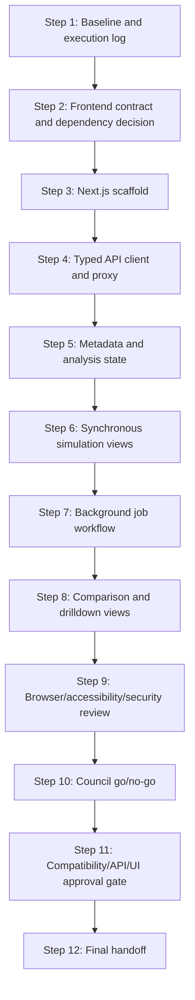

# Phase 6 Blueprint — Next.js Analysis Workspace

## Status

Proposed — awaiting human review and approval.

This Blueprint is for Phase 6 only. It does not implement Phase 6 code.

Canonical repository:

- `C:\Users\hatem\OneDrive\Desktop\Project for uri\visualize code\category-tracking`
- Current completed Phase 5 commit at planning time: `088508f feat: add in-process background job API`

## Chosen Phase 6 scope

Phase 6 should create the first working Next.js + TypeScript analysis interface over the existing FastAPI backend:

- add a frontend application under a new `frontend/` directory;
- create a typed API client for the Phase 4 synchronous endpoints and Phase 5 job endpoints;
- build an analysis-first home screen, not a marketing page;
- support the first usable views for metadata, exact simulation, aggregated simulation, exact comparison, exact-versus-sampled comparison, job submission/status/result retrieval, summary tables, codon focus, whole-population analysis, probability comparisons, and trait drilldown;
- display loading, success, empty, and error states clearly;
- keep all scientific computation in the Python backend/engine;
- avoid CORS expansion by default by using a Next.js server-side proxy or same-origin route handlers for local frontend calls;
- defer UI polish, fullscreen layouts, dense chart refinement, scientific copy refinements, exports/reports, authentication, deployment, Redis/Celery/RQ, PostgreSQL, and durable collaboration.

This is the smallest coherent Phase 6 because `future_enhancement_explained.plan.md` says Phase 6 is “Build the Next.js frontend,” and Phases 4–5 now provide the stable API and background-job contracts that the interface can consume.

## Alternatives considered

| Option | Decision | Reason |
| --- | --- | --- |
| A. Build the first Next.js analysis workspace | Chosen | This is the natural next critical-path phase after API and background jobs. |
| B. Refine Streamlit instead | Rejected | Streamlit remains a research/compatibility interface; the roadmap calls for a maintainable TypeScript UI. |
| C. Add exports/reports first | Deferred | Exports are Phase 9 and depend on stable views and wording. |
| D. Add UI polish/fullscreen/responsive refinement first | Deferred | This is Phase 7; Phase 6 must first create the working interface. |
| E. Add deployment/CORS/auth/database first | Rejected for Phase 6 | These are later concerns unless the frontend implementation proves a smaller approved need. |

## Phase classification

- Type: new frontend feature work with API-client contract work and browser QA.
- Size: large.
- Risk: high, because it introduces a new runtime/toolchain and a user-facing interface while preserving scientific/API contracts.
- Primary consumers: researchers using the Next.js workspace, existing FastAPI backend, future browser/E2E tests.
- Primary providers: Phase 4 API endpoints, Phase 5 background-job endpoints, existing engine through the API only.

## Non-goals

Phase 6 must not:

- change scientific outputs;
- rewrite engine, API, Streamlit, or Tkinter behavior;
- expose detailed sampled per-copy HTTP data;
- add exports, PDF, CSV downloads, screenshots, or report generation;
- add Redis, Celery, RQ, PostgreSQL, durable job storage, auth, accounts, CORS broadening, Docker, Kubernetes, hosting, or deployment infrastructure;
- add Phase 7 layout polish such as fullscreen sections, dense legend management, sticky control refinement, or advanced responsive polish beyond a functional baseline;
- add Phase 8 scientific wording/denominator overhaul beyond reusing approved labels and basic concise definitions;
- add arbitrary chart libraries without explicit dependency approval;
- duplicate biological tables, mutation matrices, formulas, denominators, simulation loops, or sampled RNG behavior in TypeScript.

## Required preservation rules

- Exact probability remains the authoritative deterministic scientific path.
- Aggregated sampled remains explicit and experimental.
- Phase 4 synchronous API routes remain unchanged.
- Phase 5 background-job routes and in-process job semantics remain unchanged.
- Streamlit and Tkinter compatibility remain unchanged.
- Frozen fixtures and diagnostics remain immutable unless a new Phase 6 fixture is explicitly approved.
- No test, tolerance, hash, seed, scientific contract, API contract, or diagnostic may be weakened.
- The browser never recalculates biology; it requests backend results and renders returned tables/envelopes.
- Frontend files stay under `frontend/` unless a step explicitly names another file.

## Repository mode and safety

- Use direct mode unless the user separately authorizes branches.
- Git may be inspected read-only during implementation steps.
- Do not commit or push until the final user-approved commit gate.
- Before each implementation step:
  - record UTC timestamp;
  - record touched-file manifest;
  - record file existence, bytes, and SHA-256;
  - create OS-temp backups for existing touched files;
  - append evidence to `plans/phase-6-execution-log.md`.
- Use serialized writes and serialized verification.
- No concurrent writers.
- Read-only review may run in parallel only after writes and verification stop.
- Use `PYTHONDONTWRITEBYTECODE=1` for Python verification.
- Frontend generated artifacts must never be committed or left as unexpected deliverables:
  - `frontend/.next/`;
  - `frontend/node_modules/`;
  - frontend coverage output;
  - temporary browser/test artifacts unless a step explicitly approves them.

## Universal Python verification baseline

Every Phase 6 implementation step must preserve:

```powershell
$env:PYTHONDONTWRITEBYTECODE='1'
python -m unittest discover -s tests -p "test_api_job*.py" -v
python -m unittest discover -s tests -p "test_api_*.py" -v
python -m unittest discover -s tests -p "test_*.py"
python diagnose_category_tracking_web.py
python -m tests.compat.diagnose_category_tracking_web_phase1_baseline
python -c "import sys, engine; forbidden={'streamlit','tkinter','plotly','PyQt5'}; assert not forbidden.intersection(sys.modules); print('engine-ui-independence-ok')"
```

Also verify after each applicable step:

- no `__pycache__` directories;
- frozen fixture hashes unchanged;
- diagnostic hashes unchanged;
- no root runtime imports;
- no forbidden API/engine boundary imports;
- requirements unchanged unless a dependency change is explicitly approved.
- no frontend generated artifacts are tracked or pending unexpectedly.

## Dependency graph



Parallelism:

- Steps are mostly serial because they build one frontend surface and share files.
- After Step 4, read-only review of API contract mapping can run while Step 5 design notes are prepared, but writes stay serialized.
- Browser/accessibility/security reviews in Step 9 may run as independent read-only checks after implementation verification completes.

## Step 1 — Revalidate Phase 5 and open Phase 6 execution log

### Cold-start context

Phase 5 has just been committed and pushed. Phase 6 must start from a clean, verified repository.

### Touched files

- `plans/phase-6-execution-log.md`

### Preconditions

- Phase 5 commit `088508f` is the completed pushed baseline and must be an ancestor of the implementation starting point, or the current `HEAD` if the Blueprint has not yet been committed.
- Record the current `HEAD` before implementation; it may be newer than `088508f` if this Blueprint is committed before Step 1.
- Working tree is clean.
- `plans/phase-6-nextjs-analysis-workspace.md` is approved by the user.

### Tasks

1. Use `ecc:orch-add-feature`.
2. Confirm branch, remote, current `HEAD`, Phase 5 baseline ancestry/status, and clean working tree.
3. Record UTC start timestamp.
4. Record hashes for governing files, Phase 1–6 plans/logs, API files, engine files, compatibility files, tests, fixtures, and docs.
5. Run the universal Python verification baseline.
6. Record no Phase 6 implementation has started.
7. Stop before Step 2.

### Verification

Run the universal Python verification baseline.

### Exit criteria

- Baseline is green.
- Phase 6 execution log exists.
- No frontend files or dependencies are created.

### Rollback

- Delete only `plans/phase-6-execution-log.md` if newly created and Step 1 must be abandoned.

### Handoff

Proceed to Step 2 contract/dependency decision.

## Step 2 — Freeze the Phase 6 frontend contract and dependency decision

### Cold-start context

Phase 6 needs a frontend contract before adding a new runtime/toolchain. The contract must freeze how the browser talks to the backend, which routes it consumes, how errors/loading/empty states appear, and which dependencies are allowed.

### Touched files

- `docs/phase_6_frontend_contract.md`
- `plans/phase-6-execution-log.md`

### Preconditions

- Step 1 complete.
- No frontend implementation exists unless it is recorded as pre-existing.

### Tasks

1. Use `ecc:contract-first`, `ecc:api-design`, and `ecc:frontend-patterns`.
2. Define the Phase 6 frontend provider/consumer contract:
   - provider: `frontend/` Next.js application;
   - consumed APIs: Phase 4 synchronous routes and Phase 5 job routes;
   - browser must not import Python or recalculate biology;
   - backend URL configuration;
   - proxy/no-CORS strategy;
   - request/response envelope handling;
   - loading, success, empty, error, and job polling states;
   - first analysis views;
   - dependency list and package manager;
   - frontend mock/static fixture policy, including location, approval, immutability, and non-replacement of scientific golden fixtures;
   - browser QA and accessibility expectations.
3. Decide whether Phase 6 uses:
   - `frontend/` directory;
   - Next.js + TypeScript + React;
   - npm or another package manager;
   - built-in CSS/CSS modules only or a UI/chart dependency.
4. Recommend minimal dependencies first:
   - Next.js, React, React DOM, TypeScript, ESLint tooling as generated by Next;
   - avoid chart libraries until explicitly approved, using HTML/SVG/table rendering for Phase 6 baseline.
5. State all decisions as proposed until user approval.
6. Do not create frontend code.

### Verification

Run universal Python verification baseline. Also verify only the contract and execution log changed.

### Exit criteria

- `docs/phase_6_frontend_contract.md` exists with status “Proposed — awaiting Frontend Contract approval.”
- Human decisions are clearly listed.
- Step 3 can implement without guessing.

### Rollback

- Restore `plans/phase-6-execution-log.md`.
- Remove `docs/phase_6_frontend_contract.md` only if it was newly created and the step is abandoned.

### Handoff

Stop for explicit Frontend Contract approval.

## Step 3 — Scaffold the Next.js application shell

### Cold-start context

The contract is approved. This step creates only the minimal frontend application shell and proves it builds/runs. It does not build analysis features.

### Touched files

Expected, exact list to be finalized by Step 2:

- `frontend/package.json`
- `frontend/package-lock.json` or approved lockfile
- `frontend/.gitignore` or root `.gitignore` update if needed to exclude approved generated artifacts
- `frontend/next.config.*`
- `frontend/tsconfig.json`
- `frontend/app/**`
- `frontend/components/**`
- `frontend/lib/**`
- `frontend/styles/**`
- `frontend/README.md`
- `plans/phase-6-execution-log.md`

### Preconditions

- Step 2 contract approved.
- Approved package manager and dependency list exist.
- Network/package install approval obtained if needed.

### Tasks

1. Use `ecc:orch-add-feature`, plus `ecc:nextjs-turbopack` or `ecc:react-patterns` if relevant to the generated stack.
2. Create the minimal Next.js TypeScript shell under `frontend/`.
3. Landing route must be the analysis workspace skeleton, not a marketing page.
4. Add or verify ignore rules for generated artifacts such as `.next/`, `node_modules/`, coverage, and temporary browser artifacts.
5. Add basic layout regions:
   - header/status;
   - backend connection indicator;
   - controls panel;
   - analysis tabs placeholder;
   - results panel placeholder.
6. Add frontend scripts:
   - install/build/test/lint as approved by Step 2.
7. Do not call backend yet except optional health check placeholder.

### Verification

Run, from `frontend/`, the approved frontend checks, likely:

```powershell
npm install
npm run build
npm run lint
```

Then run universal Python verification baseline from repo root.

### Exit criteria

- Next.js app builds.
- The analysis workspace shell renders.
- No backend/API/engine behavior changed.
- Generated artifacts are ignored and are not tracked/pending unexpectedly.

### Rollback

- Remove only exact newly created frontend files after path validation.
- Restore execution log from backup.

### Handoff

Proceed to typed API client and proxy.

## Step 4 — Add typed API client and backend proxy boundary

### Cold-start context

The shell exists. This step adds the frontend’s only way to communicate with FastAPI: a typed client and proxy boundary. It must not duplicate scientific logic.

### Touched files

- `frontend/lib/api/**`
- `frontend/app/api/**` or approved proxy location
- `frontend/types/**`
- `frontend/tests/**` or approved frontend test location
- `frontend/tests/fixtures/**` only if Step 2 approves compact frontend API/mock fixtures
- `frontend/README.md`
- `plans/phase-6-execution-log.md`

### Preconditions

- Step 3 complete.
- Phase 6 frontend contract approved.

### Tasks

1. Use `ecc:contract-first`, `ecc:api-design`, `ecc:frontend-patterns`, and `ecc:orch-add-feature`.
2. Re-read `docs/phase_6_frontend_contract.md`, `docs/phase_4_api_contract.md`, `docs/phase_5_job_contract.md`, and the generated FastAPI OpenAPI shape before defining frontend types.
3. Add typed envelope models for:
   - success envelopes;
   - error envelopes;
   - metadata;
   - exact simulation request/result;
   - aggregated simulation request/result;
   - exact comparison request/result;
   - exact-vs-sampled comparison request/result;
   - job accepted/status/result/error shapes.
4. Add API client functions for approved routes.
5. Add a same-origin proxy strategy so browser calls do not require backend CORS changes unless Step 2 explicitly approved CORS.
6. Add an explicit frontend/API schema parity check proving approved routes, envelopes, required fields, optional fields, and error shapes align with the Phase 4/5 contracts and OpenAPI output.
7. Add unit tests for URL construction, envelope parsing, error mapping, and no biology calculations.
8. Add source/boundary checks to ensure frontend code does not contain codon tables or mutation algorithms.

### Verification

Run approved frontend unit/build/lint checks and universal Python verification baseline.

Also verify:

- frontend typed route coverage matches the approved Phase 4 and Phase 5 API contracts;
- generated or fixture-backed OpenAPI/schema parity checks pass;
- no approved API response field used by Phase 6 views is omitted from the typed client;
- no unapproved route or detailed sampled route is introduced.

### Exit criteria

- Typed API client exists and is tested.
- Frontend/API schema parity checks pass against the approved contracts/OpenAPI surface.
- Frontend code has no biological tables, formulas, denominators, or simulation loops.
- Backend contracts remain unchanged.

### Rollback

- Restore touched frontend files and execution log from backup.

### Handoff

Proceed to metadata/state controls.

## Step 5 — Metadata loading and analysis state controls

### Cold-start context

The frontend can call the backend. This step makes the opening workspace useful by loading metadata and letting users configure small safe requests.

### Touched files

- `frontend/app/**`
- `frontend/components/**`
- `frontend/lib/state/**`
- `frontend/tests/**`
- `plans/phase-6-execution-log.md`

### Preconditions

- Step 4 complete.

### Tasks

1. Use `ecc:frontend-patterns` and `ecc:orch-add-feature`.
2. Load `GET /api/v1/metadata`.
3. Build controls for:
   - mode selection;
   - codon focus;
   - whole-population analysis;
   - probabilities;
   - generations;
   - sampled seed and copy/count settings where relevant;
   - comparison baseline/candidate inputs.
4. Add client-side validation for UI completeness only; backend remains authoritative.
5. Show loading, success, empty, and concise error states.
6. Keep approved scientific labels from backend/metadata.

### Verification

Run frontend checks and universal Python verification baseline.

### Exit criteria

- Metadata-driven controls render.
- No hardcoded biological definitions are duplicated.
- Empty/error/loading states are visible and tested.

### Rollback

- Restore touched frontend files and execution log.

### Handoff

Proceed to synchronous simulation views.

## Step 6 — Implement synchronous exact and aggregated simulation views

### Cold-start context

Controls exist. This step displays the first real results from the existing synchronous API endpoints.

### Touched files

- `frontend/components/results/**`
- `frontend/components/charts/**`
- `frontend/app/**`
- `frontend/tests/**`
- `plans/phase-6-execution-log.md`

### Preconditions

- Step 5 complete.

### Tasks

1. Use `ecc:orch-add-feature`.
2. Call:
   - `POST /api/v1/simulations/exact`;
   - `POST /api/v1/simulations/aggregated`.
3. Render returned tables as:
   - readable tables;
   - simple Phase 6-safe SVG/HTML chart summaries if approved;
   - summary cards for key outputs.
4. Cover codon focus and whole-population analysis.
5. Preserve “Exact probability” and “experimental sampled/aggregated” distinction.
6. Do not add advanced chart polish, fullscreen, exports, or denominator copy beyond the approved minimal contract.

### Verification

Run frontend checks, browser smoke if available, and universal Python verification baseline.

### Exit criteria

- Exact and aggregated sync results render.
- Loading/success/empty/error states work.
- Values are displayed from API responses only.

### Rollback

- Restore touched files and execution log.

### Handoff

Proceed to background job workflow.

## Step 7 — Implement background job workflow

### Cold-start context

The UI can show synchronous results. This step adds optional background execution for the same categories of requests using Phase 5 job endpoints.

### Touched files

- `frontend/components/jobs/**`
- `frontend/lib/jobs/**`
- `frontend/app/**`
- `frontend/tests/**`
- `plans/phase-6-execution-log.md`

### Preconditions

- Step 6 complete.
- Phase 5 job contract remains unchanged.

### Tasks

1. Use `ecc:orch-add-feature`.
2. Add job submission for:
   - exact jobs;
   - aggregated jobs;
   - exact comparison jobs;
   - exact-vs-sampled jobs.
3. Add status polling with bounded interval and explicit stop conditions.
4. Add result retrieval and display.
5. Add retry and delete/cancel controls if approved in Step 2 UI contract.
6. Display queued, running, completed, failed, cancel_requested, cancelled, and expired states.
7. Never expose detailed sampled per-copy paths.

### Verification

Run frontend checks, focused API job smoke, and universal Python verification baseline.

### Exit criteria

- Job lifecycle is visible in UI.
- Polling is bounded and stops at terminal states.
- Failure and retry/error states are clear.

### Rollback

- Restore touched files and execution log.

### Handoff

Proceed to comparison and trait drilldown views.

## Step 8 — Add comparison and trait drilldown views

### Cold-start context

The UI can run simulations and jobs. This step completes the first Phase 6 analysis workspace coverage promised by the future plan.

### Touched files

- `frontend/components/comparisons/**`
- `frontend/components/drilldown/**`
- `frontend/components/results/**`
- `frontend/tests/**`
- `plans/phase-6-execution-log.md`

### Preconditions

- Step 7 complete.

### Tasks

1. Use `ecc:orch-add-feature`.
2. Add exact comparison view from `POST /api/v1/comparisons/exact`.
3. Add exact-vs-sampled comparison view from `POST /api/v1/comparisons/exact-vs-sampled`.
4. Add trait drilldown panels based only on returned API/metadata tables.
5. Add summary tables that use stable returned table columns and labels.
6. Avoid Phase 8 scientific wording overhaul and Phase 9 exports.

### Verification

Run frontend checks, browser smoke, and universal Python verification baseline.

### Exit criteria

- Core Phase 6 views work against backend contracts.
- No browser-side scientific calculations exist.
- All states are tested.

### Rollback

- Restore touched files and execution log.

### Handoff

Proceed to QA/review.

## Step 9 — Browser QA, accessibility pass, and frontend security review

### Cold-start context

The first frontend is implemented. It needs browser-facing QA before approval.

### Touched files

- `frontend/tests/**` only if adding missing non-production tests is necessary.
- `plans/phase-6-execution-log.md`

### Preconditions

- Steps 3–8 complete.
- Local FastAPI and frontend servers can start, or the inability is recorded.

### Tasks

1. Use `ecc:browser-qa`.
2. Use `ecc:accessibility`.
3. Use `ecc:security-review`.
4. Run read-only browser QA for:
   - home/workspace route;
   - metadata loading;
   - exact simulation flow;
   - aggregated simulation flow;
   - job submission/status/result flow;
   - comparison flow;
   - error state.
5. Run basic accessibility checks:
   - keyboard navigation;
   - labels;
   - focus states;
   - landmarks;
   - contrast issues where practical.
6. Run frontend security review:
   - no secrets;
   - no unsafe HTML injection;
   - no auth claims;
   - no unbounded polling;
   - no CORS broadening unless approved;
   - no backend URL leakage beyond approved config.

### Verification

Run frontend checks, browser QA, accessibility checks, and universal Python verification baseline.

### Exit criteria

- No unresolved CRITICAL/HIGH QA, accessibility, or security finding remains.
- MEDIUM/LOW findings have owner and disposition.

### Rollback

- Restore test/log files from backup.

### Handoff

Proceed to Council go/no-go.

## Step 10 — Council go/no-go

### Cold-start context

Implementation, browser QA, accessibility, and frontend security review are complete. A structured go/no-go decision is needed before approval.

### Touched files

- `plans/phase-6-execution-log.md`

### Preconditions

- Step 9 complete.
- Findings include severity, evidence, owner, consequence, and disposition.

### Tasks

1. Use `ecc:council`.
2. Convene Architect, Skeptic, Pragmatist, and Critic.
3. Decide:
   - `PROCEED` to Compatibility/API/UI Approval Gate;
   - `REOPEN` an owning Step 3–9;
   - `BLOCK FOR CONTRACT DECISION`.
4. Append the verdict to the execution log.

### Verification

- Confirm Council prerequisites.
- Confirm no files except execution log changed.

### Exit criteria

- Council verdict is recorded.
- If `PROCEED`, Step 11 may start only after user approval.

### Rollback

- Restore execution log from backup if malformed.

### Handoff

Proceed according to Council verdict.

## Step 11 — Compatibility/API/UI approval gate

### Cold-start context

Council has approved proceeding. This step proves the frontend, backend, Streamlit, Tkinter, tests, and contracts can coexist.

### Touched files

- `plans/phase-6-execution-log.md`

### Preconditions

- Step 10 verdict is `PROCEED`.
- User approved starting Step 11.

### Tasks

1. Use `ecc:delivery-gate`.
2. Run universal Python verification baseline.
3. Run approved frontend build/lint/test checks.
4. Run browser smoke if available.
5. Verify:
   - FastAPI routes unchanged;
   - Phase 5 job routes unchanged;
   - frontend uses typed API client/proxy only;
   - no browser biology;
   - no unapproved dependencies;
   - no CORS/auth/deployment leak;
   - Streamlit/Tkinter remain compatible.
6. Resolve deferred LOW findings by recommendation only.
7. Stop for explicit user approval before Step 12.

### Verification

Run universal Python verification baseline and all approved frontend checks.

### Exit criteria

- No unresolved CRITICAL/HIGH/MEDIUM finding remains unless explicitly approved for deferral.
- User is asked to approve final handoff.

### Rollback

- Restore execution log from backup.

### Handoff

Proceed to final delivery gate after user approval.

## Step 12 — Final delivery gate and handoff

### Cold-start context

All implementation and approval gates passed. This step records final evidence and prepares commit handoff.

### Touched files

- `plans/phase-6-execution-log.md`

### Preconditions

- Step 11 approved by user.

### Tasks

1. Use `ecc:delivery-gate`.
2. Run final Python and frontend verification.
3. Run final boundary/hash audit.
4. Confirm Phase 7 was not started.
5. Confirm no unapproved dependency/infrastructure/auth/deployment work was added.
6. Record final evidence, backup locations, deferred findings, and recommended commit message.
7. Stop before commit.

### Verification

Universal Python verification baseline plus approved frontend checks.

### Exit criteria

- Final handoff is complete.
- No unresolved blocker remains.
- User is asked to approve commit.

### Rollback

- Restore only manifest-listed files from recorded backups.
- Rerun verification.

### Handoff

Recommended commit message:

```text
feat: add Next.js analysis workspace
```

## Approval gates

| Gate | After step | Required approval |
| --- | ---: | --- |
| Blueprint approval | Blueprint | Approve Phase 6 plan before Step 1. |
| Frontend contract/dependency approval | Step 2 | Approve frontend directory, package manager, dependency list, proxy/CORS approach, and first-view scope. |
| Browser/accessibility/security gate | Step 9 | Resolve CRITICAL/HIGH findings before Council. |
| Council go/no-go | Step 10 | Decide PROCEED, REOPEN, or BLOCK. |
| Compatibility/API/UI approval gate | Step 11 | User approves final compatibility state before handoff. |
| Final delivery/commit gate | Step 12 | User approves commit. |

## Recommended ECC skill order

1. `ecc:orch-add-feature` — Step 1 baseline/log setup only.
2. `ecc:contract-first` + `ecc:api-design` + `ecc:frontend-patterns` — Step 2 frontend contract and dependency decision.
3. `ecc:orch-add-feature` + `ecc:nextjs-turbopack` or `ecc:react-patterns` — Step 3 scaffold.
4. `ecc:contract-first` + `ecc:api-design` + `ecc:frontend-patterns` + `ecc:orch-add-feature` — Step 4 typed API client/proxy and schema-parity boundary.
5. `ecc:orch-add-feature` + `ecc:frontend-patterns` — Steps 5–8 TDD implementation.
6. `ecc:browser-qa` — Step 9 browser smoke QA.
7. `ecc:accessibility` — Step 9 accessibility pass.
8. `ecc:security-review` — Step 9 frontend/API boundary security review.
9. `ecc:council` — Step 10 go/no-go.
10. `ecc:delivery-gate` — Step 11 compatibility/API/UI approval gate.
11. `ecc:delivery-gate` — Step 12 final handoff.

## Unresolved decisions requiring user approval

These must be resolved in Step 2:

| Decision | Recommended option | Status |
| --- | --- | --- |
| Frontend directory | `frontend/` | Proposed — awaiting approval |
| Framework | Next.js + React + TypeScript | Proposed — awaiting approval |
| Package manager | npm with committed `package-lock.json` | Proposed — awaiting approval |
| API access strategy | Next.js same-origin proxy/route handlers to avoid backend CORS changes | Proposed — awaiting approval |
| Backend URL config | `FRONTEND_API_BASE_URL` server-side env, localhost default for dev | Proposed — awaiting approval |
| Styling | CSS modules or plain CSS first | Proposed — awaiting approval |
| Charting | Use simple HTML/SVG/table rendering in Phase 6; defer chart library to Phase 7 unless approved | Proposed — awaiting approval |
| First frontend views | metadata, controls, exact, aggregated, jobs, comparisons, trait drilldown, summary tables | Proposed — awaiting approval |
| Retry/cancel UI | Expose only if Step 2 approves controls and copy | Proposed — awaiting approval |
| Static frontend fixtures | If needed, place compact UI/API mock fixtures under `frontend/tests/fixtures/**`; freeze hashes; never use them as replacements for Phase 1–5 scientific/API golden fixtures | Proposed — awaiting approval |

## Anti-pattern catalog

- Do not duplicate codon tables, amino-acid mappings, mutation matrices, category definitions, denominators, or simulation formulas in TypeScript.
- Do not call Python files directly from the frontend.
- Do not broaden backend CORS unless explicitly approved.
- Do not add auth, accounts, persistence, deployment, Redis/Celery/RQ, Docker, Kubernetes, or database work.
- Do not expose detailed sampled per-copy records.
- Do not add exports/reports in Phase 6.
- Do not turn the opening page into a marketing landing page.
- Do not hide loading/error/empty states.
- Do not weaken backend tests because frontend tests pass.
- Do not modify Streamlit/Tkinter compatibility.
- Do not skip browser/accessibility/security review.
- Do not commit generated build artifacts such as `.next/`, `node_modules/`, or coverage output.

## Risk assessment

| Risk | Severity | Mitigation |
| --- | --- | --- |
| Frontend duplicates scientific logic | HIGH | Boundary tests and source scans; API-only data flow. |
| Dependency/toolchain drift | HIGH | Step 2 dependency approval; lockfile; build/lint/test gates. |
| CORS or deployment scope creep | HIGH | Prefer same-origin proxy; explicit non-goals. |
| Backend contract mismatch | HIGH | Typed client tests and OpenAPI/fixture checks. |
| UI becomes too broad for Phase 6 | MEDIUM | Defer Phase 7 polish and Phase 9 exports. |
| Accessibility regressions | MEDIUM | Step 9 accessibility pass before approval. |
| Browser polling overload | MEDIUM | Bounded polling and terminal-state stop conditions. |

## Formal plan-mutation protocol

If evidence shows this Blueprint is wrong:

1. Record the evidence and affected step in `plans/phase-6-execution-log.md`.
2. Classify the issue as frontend contract, API contract, dependency, security, accessibility, implementation, or scope.
3. Propose the smallest Blueprint/contract mutation.
4. Record touched-file and rollback impact.
5. Stop for explicit user approval.
6. After approval, update the authoritative contract/Blueprint first.
7. Add failing tests.
8. Implement only the approved mutation.
9. Rerun focused frontend checks and universal Python verification.
10. Resume from the affected step.

No implementation-first contract changes are allowed.

## Deferred work

- Phase 7 UI refinement: sticky controls, fullscreen, dense chart sizing, non-overlapping legends, refined responsive layouts.
- Phase 8 science-explicit wording and denominator/definition polish.
- Phase 9 exports and reports.
- Phase 10 automated E2E/testing pyramid expansion beyond the checks needed for Phase 6.
- Phase 11 deployment, hosting, Redis/workers, PostgreSQL, auth, CORS production policy, and production observability.

## Completion checklist

- [x] Phase 6 scope chosen.
- [x] Phase 1–5 preservation rules included.
- [x] Frontend contract/dependency gate included.
- [x] Step-by-step implementation plan included.
- [x] Dependency graph included.
- [x] Touched files and verification commands included for each step.
- [x] Browser QA, accessibility, and security review gates included.
- [x] Compatibility/API/UI approval gate included.
- [x] Final delivery/commit gate included.
- [x] Anti-pattern catalog included.
- [x] Plan mutation protocol included.
- [x] Unresolved decisions listed.
- [x] No Phase 6 implementation code included.

## Adversarial review record

Strongest-model read-only adversarial review completed during Blueprint construction.

| Finding | Severity | Disposition |
| --- | --- | --- |
| Step 4 needed explicit frontend/API schema parity proof. | HIGH | Resolved by adding contract/OpenAPI parity tasks, verification, and exit criteria to Step 4. |
| Step 1 hardcoded latest commit `088508f`, which could become stale if the Blueprint is committed. | MEDIUM | Resolved by treating `088508f` as the completed Phase 5 baseline and requiring current `HEAD` recording at implementation time. |
| Generated frontend artifacts needed an active guardrail. | MEDIUM | Resolved by adding generated-artifact ignore/touched-file handling and verification. |
| Frontend mock/static fixture policy needed an explicit location and immutability rule. | MEDIUM | Resolved by adding `frontend/tests/fixtures/**` policy and approval decision. |
| Recommended skill order omitted Step 4 contract-first recheck. | LOW | Resolved by adding `ecc:contract-first` to Step 4 skill sequence. |

No unresolved CRITICAL or HIGH Blueprint-review findings remain.
