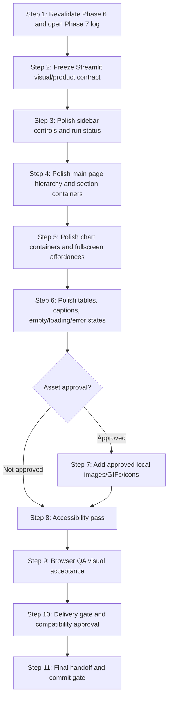

# Phase 7 Blueprint — Streamlit Product Polish and Visual System

## Status

Proposed — awaiting human review and approval.

This Blueprint is for Phase 7 only. It does not implement Phase 7 code.

Canonical repository:

- `C:\Users\hatem\OneDrive\Desktop\Project for uri\visualize code\category-tracking`
- Phase 6 completed, approved, committed, and pushed at `e55925f feat: finalize Streamlit primary frontend for Phase 6`.

Blueprint registration note:

- This planning task creates `plans/phase-7-streamlit-product-polish.md` without committing it.
- Before Phase 7 Step 1 begins, the executor must either:
  1. confirm this Blueprint has been committed/pushed after human approval; or
  2. record this approved Blueprint file as the only allowed pre-existing working-tree exception.
- Step 1 must not proceed if any other uncommitted or untracked file is present without explicit user approval.

## Objective

Polish the accepted Streamlit app into a cleaner, more visually professional product while preserving the exact existing chart/data behavior, section order, scientific outputs, compatibility APIs, and one-button workflow.

Phase 7 is a UI/product-polish phase. It is not a scientific, backend, API, engine, Next.js, deployment, database, authentication, or infrastructure phase.

The primary accepted user-facing frontend remains:

- `category_tracking_web.py`

The Phase 6 Next.js workspace remains:

- deferred;
- experimental;
- non-primary;
- not the release UI unless a later approved phase or contract mutation promotes it.

## Phase classification

- Type: Streamlit UI/product polish and visual-system refinement.
- Size: medium.
- Scientific risk: low if touched-file and chart/data preservation boundaries are honored.
- Acceptance risk: high, because visual polish is subjective and must be reviewed by the user in the live Streamlit app.
- Execution mode: direct mode with serialized writes and serialized verification.

## Authoritative context

Every Phase 7 executor must read these files before its assigned step:

- `CLAUDE.md`
- `.ai-style-rules.md`
- `README.md`
- `future_enhancement_explained.plan.md`
- `plans/phase-1-extract-ui-independent-engine.md`
- `plans/phase-1-execution-log.md`
- `plans/phase-2-strengthen-computation.md`
- `plans/phase-2-execution-log.md`
- `plans/phase-3-optimize-computation.md`
- `plans/phase-3-execution-log.md`
- `plans/phase-4-fastapi-backend.md`
- `plans/phase-4-execution-log.md`
- `plans/phase-5-in-process-background-jobs.md`
- `plans/phase-5-execution-log.md`
- `plans/phase-6-nextjs-analysis-workspace.md`
- `plans/phase-6-execution-log.md`
- `docs/phase_2_scientific_contract.md`
- `docs/phase_4_api_contract.md`
- `docs/phase_5_job_contract.md`
- `docs/phase_6_frontend_contract.md`
- `engine/README.md`
- `frontend/README.md`
- `category_tracking_web.py`
- `diagnose_category_tracking_web.py`
- `tests/test_streamlit_surface.py`
- `tests/test_streamlit_engine_boundary.py`
- `tests/fixtures/phase1_streamlit_surface.json`
- `tests/compat/diagnose_category_tracking_web_phase1_baseline.py`

Step-specific executors must also read every file named in that step's touched-file or verification section.

After Step 2 is approved, every Step 3-11 executor must also read:

- `docs/phase_7_streamlit_visual_contract.md`

That contract becomes the step-local visual authority for Streamlit polish. No Step 3-11 edit may proceed without confirming the contract is approved or explicitly recording that the step is blocked.

## Current accepted baseline

- Streamlit is the accepted release frontend.
- The app is run from the repository root with:

```powershell
python -m streamlit run category_tracking_web.py
```

- `category_tracking_web.py` imports scientific behavior from `engine/`.
- The engine remains the single source of truth for biological definitions, mutation matrices, exact propagation, sampled simulation, aggregated sampled counters, denominators, comparisons, summaries, and invariants.
- Streamlit owns presentation: controls, validation messages, Plotly figures, fullscreen dialogs, containers, captions, and visual layout.
- The existing Streamlit chart experience is visually accepted and must not be replaced by different chart semantics.

## Non-goals

Phase 7 must not:

- change scientific calculations;
- change exact probability outputs;
- change sampled RNG behavior;
- change aggregated sampled contracts or memory bounds;
- change engine APIs;
- change FastAPI routes, serializers, models, or job behavior;
- change Streamlit/Tkinter compatibility APIs;
- make Next.js primary;
- rewrite the app in React, Next.js, or another frontend framework;
- add deployment, hosting, Docker, Kubernetes, Redis, Celery, RQ, PostgreSQL, database, authentication, authorization, accounts, or external services;
- add dependencies unless a step explicitly proposes them and the user approves them first;
- regenerate or modify frozen fixtures;
- weaken tests, tolerances, diagnostic checks, hashes, or scientific contracts;
- hide existing scientific charts/tables;
- change chart data to make the UI look nicer;
- simplify scientific terminology in a misleading way;
- start Phase 8.

## Product visual contract

Phase 7 may improve:

- visual hierarchy;
- spacing rhythm;
- section grouping;
- headers, subheaders, captions, and helper text;
- card/container styling through Streamlit-native patterns where possible;
- sidebar readability;
- runtime/status presentation;
- chart surrounding layout;
- table readability;
- fullscreen affordances;
- empty/loading/error states;
- use of local images, GIFs, or icons after explicit asset approval;
- accessibility and keyboard clarity.

"Clean product" means:

- users can immediately understand what to configure, what button to press, and how to read the results;
- sections are visually ordered and not cluttered;
- dense scientific results remain readable;
- charts and tables have clear headings/captions;
- labels stay consistent with the accepted scientific language;
- decorative assets support the analysis rather than distracting from it;
- no developer/debug/gibberish wording appears in the normal UI.

## Chart/data preservation contract

Phase 7 may style containers and surrounding explanatory text. It must not change:

- chart type;
- plotted series;
- axes;
- axis units;
- legend labels;
- category ordering;
- row ordering;
- table columns;
- table meanings;
- data sources;
- denominator semantics;
- fullscreen behavior that already exists;
- one-button workflow;
- accepted control order unless a step explicitly asks for human approval first.

Any request to change a chart type, chart data, table contents, scientific wording, denominator wording, or result ordering requires the plan-mutation protocol before implementation.

## Asset policy

Phase 7 may propose a local asset directory only after user approval:

- `assets/`

Potential asset types:

- local PNG/JPG/SVG images;
- local GIFs;
- local icons;
- small decorative/educational diagrams.

Rules:

- assets must be local, reviewed, and committed intentionally;
- large assets require explicit approval before creation or addition;
- assets must not require new third-party packages unless separately approved;
- assets must not contain secrets, private paths, personal information, or external tracking;
- visual assets must not obscure charts/tables or change scientific interpretation.

`.streamlit/config.toml` may be touched only if a step explicitly proposes a theme-level change and the user approves that touched-file expansion.

Theme-level changes are optional and gated:

- If the user wants theme-level polish, Step 2 must include a theme decision in the visual contract.
- `.streamlit/config.toml` may be edited only in Step 3 or Step 4 after explicit theme approval.
- Theme edits may adjust Streamlit visual tokens only; they must not change chart data, engine behavior, API behavior, or scientific text meaning.
- If theme approval is not granted, `.streamlit/config.toml` is prohibited for all Phase 7 implementation steps.

## Touched-file boundaries

Likely allowed during implementation:

- `category_tracking_web.py`
- `tests/test_streamlit_surface.py`
- `README.md`
- `plans/phase-7-execution-log.md`
- `docs/phase_7_streamlit_visual_contract.md`
- `assets/**`, only after explicit asset approval
- `.streamlit/config.toml`, only after explicit theme approval

Likely prohibited:

- `engine/**`
- `api/**`
- `frontend/**`
- `requirements.txt`, unless a dependency change is explicitly approved
- `frontend/package.json`
- `frontend/package-lock.json`
- `tests/fixtures/**`
- `diagnose_category_tracking_web.py`
- `tests/compat/diagnose_category_tracking_web_phase1_baseline.py`
- prior phase contract documents except as read-only references

## Universal verification baseline

Every implementation step must preserve:

```powershell
$env:PYTHONDONTWRITEBYTECODE='1'
python -m unittest discover -s tests -p "test_streamlit_surface.py" -v
python diagnose_category_tracking_web.py
python -m tests.compat.diagnose_category_tracking_web_phase1_baseline
python -m unittest discover -s tests -p "test_*.py"
python -m unittest discover -s tests -p "test_api_job*.py" -v
python -m unittest discover -s tests -p "test_api_*.py" -v
python -c "import sys, engine; forbidden={'streamlit','tkinter','plotly','PyQt5'}; assert not forbidden.intersection(sys.modules); print('engine-ui-independence-ok')"
```

Also verify after every implementation step:

- frozen fixture hashes unchanged;
- diagnostic file hashes unchanged;
- diagnostic output status remains all 17 `PASS` lines for both diagnostic commands;
- no root runtime imports;
- no forbidden engine imports;
- no `__pycache__` directories;
- no unexpected generated files;
- Git untouched until the final user-approved commit gate.

Step 1 must establish the immutable comparison inventory for later steps. At minimum it must record byte counts and SHA-256 values for:

- `diagnose_category_tracking_web.py`;
- `tests/compat/diagnose_category_tracking_web_phase1_baseline.py`;
- `tests/fixtures/phase1_scientific_baseline.json`;
- `tests/fixtures/phase1_streamlit_surface.json`;
- `tests/fixtures/phase2_scientific_contract.json`;
- `tests/fixtures/phase5_openapi.json`;
- `requirements.txt`;
- `.streamlit/config.toml`, if present;
- `category_tracking_web.py`;
- `tests/test_streamlit_surface.py`;
- all prior approved contract documents.

Later steps compare against the Step 1 inventory for immutable files and record post-change hashes for touched files.

## Browser QA baseline

Phase 7 browser QA uses the accepted Streamlit app:

```powershell
$env:PYTHONDONTWRITEBYTECODE='1'
python -m streamlit run category_tracking_web.py --server.address 127.0.0.1 --server.port 8501 --server.headless true
```

Browser QA must verify:

- app loads;
- sidebar controls work;
- one-button workflow remains clear;
- codon focus works;
- whole population works;
- compare both works;
- fullscreen section controls work;
- charts render;
- tables render;
- no traceback;
- no unexpected console errors;
- visual polish is accepted by the user before final handoff.

Stop the local Streamlit server cleanly after QA unless the user explicitly asks to keep it running.

Port handling:

- Check whether `127.0.0.1:8501` is already listening before starting Streamlit.
- Do not stop or kill an unrelated process without explicit user approval.
- If a known local Streamlit process from the current QA run is already active, reuse or stop it cleanly as recorded.
- If port `8501` is occupied by an unrelated process, either stop and ask or use a recorded alternate local port for that QA run only.

Visual evidence:

- Step 9 must record dated browser QA notes for at least:
  - initial app load;
  - sidebar/control area;
  - codon focus;
  - whole population;
  - compare both;
  - fullscreen section;
  - invalid input/error state.
- Screenshots may be captured only if the user or browser QA workflow approves artifacts. If screenshots are not captured, the execution log must include concrete observed UI evidence and the user's exact acceptance or requested changes.

## Accessibility baseline

Phase 7 must preserve or improve:

- keyboard reachability of controls and buttons;
- visible focus;
- labels and accessible names for controls;
- understandable status/loading text;
- chart/table headings and captions;
- non-color-only status meaning;
- acceptable contrast for key text and states;
- no obvious keyboard traps;
- readable layout at common desktop sizes and reasonable responsive behavior where practical.

## Dependency graph



Parallelism:

- Steps 1–6 are serial because they share the Streamlit app and surface tests.
- Step 7 is conditional on explicit asset approval.
- Steps 8–10 are review/verification gates and must run after implementation writes stop.
- No concurrent writers or concurrent verification processes are allowed in direct mode.

## Step 1 — Revalidate Phase 6 and open Phase 7 execution log

### Context brief

Phase 6 has been committed and pushed. Streamlit is accepted as the primary frontend. Phase 7 must start from a clean, verified baseline before any visual polish.

If this Blueprint is not yet committed at Step 1 start, the only permitted working-tree exception is `plans/phase-7-streamlit-product-polish.md` after explicit human approval of the Blueprint. Any other uncommitted or untracked file blocks Step 1 until the user gives direction.

### Recommended ECC skill

- `ecc:orch-add-feature`

### Touched files

- `plans/phase-7-execution-log.md`

### Tasks

1. Confirm current branch, latest commit, remote, and clean working tree.
2. Confirm `e55925f` or a later approved commit is the current baseline.
3. If the Blueprint file is uncommitted, record it as the approved planning exception; otherwise confirm the working tree is clean.
4. Confirm `category_tracking_web.py` is the accepted primary frontend.
5. Confirm `frontend/` remains deferred/experimental/non-primary.
6. Record UTC start timestamp.
7. Record hashes and byte counts for governing files, prior phase plans/logs, contracts, Streamlit app, tests, diagnostics, fixtures, engine files, API files, README files, and dependency files.
8. Run the universal verification baseline.
9. Create `plans/phase-7-execution-log.md`.
10. Record commands, exit codes, diagnostic pass counts, hashes, boundary checks, and Step 1 exit criteria.

### Verification

Use the universal verification baseline.

### Exit criteria

- Full suite passes.
- Both diagnostics pass all 17 checks.
- Streamlit surface tests pass.
- Engine UI-independence passes.
- Working tree changes are limited to `plans/phase-7-execution-log.md` and, only if not yet committed, the approved Blueprint file.
- No Phase 7 implementation code was written.

### Rollback

Remove only `plans/phase-7-execution-log.md` if newly created, after verifying the exact resolved path. Rerun the Phase 6 verification baseline.

## Step 2 — Freeze the Streamlit visual/product contract

### Context brief

Before changing UI polish, freeze what may be styled and what must remain identical. This prevents product polish from drifting into scientific or chart/data changes.

### Recommended ECC skills

- `ecc:contract-first`
- `ecc:frontend-design-direction`

### Touched files

- `docs/phase_7_streamlit_visual_contract.md`
- `plans/phase-7-execution-log.md`

### Tasks

1. Create `docs/phase_7_streamlit_visual_contract.md` with status `Proposed — awaiting Streamlit Visual Contract approval`.
2. Define accepted Streamlit primary frontend authority.
3. Define visual-system goals:
   - layout hierarchy;
   - spacing;
   - section/card language;
   - helper text;
   - chart containers;
   - table readability;
   - fullscreen affordances;
   - loading/status style;
   - optional assets.
4. Define strict chart/data preservation rules.
5. Define asset approval rules.
6. Define theme approval rules, including whether `.streamlit/config.toml` may be touched.
7. Define accessibility expectations.
8. Define prohibited changes.
9. Present the contract and stop for explicit human approval.

### Verification

```powershell
$env:PYTHONDONTWRITEBYTECODE='1'
python -m unittest discover -s tests -p "test_streamlit_surface.py" -v
python diagnose_category_tracking_web.py
python -m tests.compat.diagnose_category_tracking_web_phase1_baseline
```

### Exit criteria

- Contract exists and is complete.
- Contract is not marked approved by the agent.
- No UI implementation occurred.
- User approval is requested before Step 3.

### Rollback

Restore `plans/phase-7-execution-log.md` from backup and remove `docs/phase_7_streamlit_visual_contract.md` only if newly created and its exact path is validated.

## Step 3 — Polish sidebar controls and run-status presentation

### Context brief

The sidebar is the user's control cockpit. Polish it without changing control order, labels, defaults, query bindings, or the one-button workflow unless the visual contract explicitly approves a small wording/layout change.

Read `docs/phase_7_streamlit_visual_contract.md` completely before editing. Stop if it is absent or not approved.

### Recommended ECC skills

- `developing-with-streamlit`
- `ecc:orch-refine-code`

### Touched files

- `category_tracking_web.py`
- `tests/test_streamlit_surface.py`
- `plans/phase-7-execution-log.md`
- `.streamlit/config.toml`, only if explicitly approved in Step 2

### Tasks

1. Use TDD.
2. Add/update surface tests for the approved sidebar visual contract.
3. Improve grouping, spacing, captions, and runtime/status visibility.
4. Preserve:
   - widget order;
   - widget keys;
   - default values;
   - query bindings;
   - one-button workflow;
   - probability input behavior.
5. If the visual contract approved `.streamlit/config.toml`, implement only the approved theme token change; otherwise do not touch theme files.
6. Avoid adding scientific calculations to render code.

### Verification

Run focused Streamlit tests first, then the universal verification baseline.

### Exit criteria

- Sidebar looks cleaner.
- Runtime/status information remains visible.
- Existing controls remain discoverable and stable.
- Tests and diagnostics pass.

### Rollback

Restore only manifest-listed files from the Step 3 backup and rerun the Step 2 verification baseline.

## Step 4 — Polish main page hierarchy, hero/header, explanatory copy, and section containers

### Context brief

The main page should feel like a coherent scientific product, not a stack of raw components. Polish section hierarchy and explanatory text while preserving accepted section order and results.

Read `docs/phase_7_streamlit_visual_contract.md` completely before editing. Stop if it is absent or not approved.

### Recommended ECC skills

- `developing-with-streamlit`
- `ecc:frontend-design-direction`
- `ecc:orch-refine-code`

### Touched files

- `category_tracking_web.py`
- `tests/test_streamlit_surface.py`
- `plans/phase-7-execution-log.md`
- `README.md`, only if launch/use wording needs a tiny update
- `.streamlit/config.toml`, only if explicitly approved in Step 2

### Tasks

1. Use TDD for approved headings/section-surface expectations.
2. Improve header/hero clarity.
3. Improve section grouping and visual rhythm.
4. Remove any remaining debug-like wording from the normal UI.
5. Preserve all chart/table sections and their order.
6. Preserve accepted scientific terminology.
7. Constrain any README edit to launch/use wording only; do not edit roadmap, architecture, API, or scientific contract material.

### Verification

Run focused Streamlit tests, browser smoke if practical, then the universal verification baseline.

### Exit criteria

- Main page hierarchy is cleaner.
- Section order is unchanged unless explicitly approved.
- No chart/data behavior changed.
- Tests and diagnostics pass.

### Rollback

Restore only manifest-listed files from the Step 4 backup and rerun the Step 3 verification baseline.

## Step 5 — Polish chart containers and fullscreen affordances

### Context brief

Charts are already accepted. This step improves the surrounding presentation and fullscreen discoverability, not chart semantics.

Read `docs/phase_7_streamlit_visual_contract.md` completely before editing. Stop if it is absent or not approved.

### Recommended ECC skills

- `developing-with-streamlit`
- `ecc:orch-refine-code`

### Touched files

- `category_tracking_web.py`
- `tests/test_streamlit_surface.py`
- `plans/phase-7-execution-log.md`

### Tasks

1. Use TDD for approved chart-container/fullscreen expectations.
2. Improve chart panel spacing, headings, captions, and fullscreen button consistency.
3. Preserve every Plotly figure's:
   - chart type;
   - traces;
   - axes;
   - legends;
   - data frames;
   - ordering;
   - titles unless the visual contract approves wording-only clarification.
4. Keep compare-both side-by-side behavior.
5. Keep existing fullscreen dialogs working.

### Verification

Run focused Streamlit tests, browser QA for chart/fullscreen flows, then the universal verification baseline.

### Exit criteria

- Chart areas are visually cleaner.
- Fullscreen affordances are consistent.
- Chart semantics and data remain unchanged.
- Tests, diagnostics, and browser QA pass.

### Rollback

Restore only manifest-listed files from the Step 5 backup and rerun the Step 4 verification baseline.

## Step 6 — Polish tables, captions, empty/loading/error states

### Context brief

Dense scientific tables need clearer framing. This step improves presentation and messages without changing table data, columns, or ordering.

Read `docs/phase_7_streamlit_visual_contract.md` completely before editing. Stop if it is absent or not approved.

### Recommended ECC skills

- `developing-with-streamlit`
- `ecc:orch-refine-code`

### Touched files

- `category_tracking_web.py`
- `tests/test_streamlit_surface.py`
- `plans/phase-7-execution-log.md`

### Tasks

1. Use TDD for approved table/caption/error-state expectations.
2. Improve captions and table context.
3. Improve empty/loading/error messages.
4. Preserve:
   - DataFrame columns;
   - row order;
   - numeric values;
   - format semantics;
   - validation behavior.
5. Keep user-facing errors concise and actionable.

### Verification

Run focused Streamlit tests, diagnostics, and the universal verification baseline.

### Exit criteria

- Tables and messages are more readable.
- No data shape or scientific behavior changed.
- Tests and diagnostics pass.

### Rollback

Restore only manifest-listed files from the Step 6 backup and rerun the Step 5 verification baseline.

## Step 7 — Add approved local images/GIFs/icons, if approved

### Context brief

Assets are optional. If the user approves assets, add them as local product polish. If not approved, record a normal Step 7 skip and proceed to Step 8.

Read `docs/phase_7_streamlit_visual_contract.md` completely before editing. Stop if it is absent or not approved.

If the Asset Gate is declined, record a normal Step 7 skip in `plans/phase-7-execution-log.md` and proceed to Step 8. This is not a plan mutation because the dependency graph already models the no-assets path.

### Recommended ECC skills

- `developing-with-streamlit`
- `ecc:frontend-design-direction`

### Touched files

- `assets/**`, only if approved
- `category_tracking_web.py`
- `tests/test_streamlit_surface.py`
- `plans/phase-7-execution-log.md`
- `README.md`, only if asset usage needs documentation

### Tasks

1. Stop and ask for explicit asset approval before adding any asset.
2. Record asset source, license/ownership status, size, dimensions, and hash.
3. Add only local assets.
4. Use assets decoratively or educationally, not as scientific output.
5. Ensure assets do not obscure controls, charts, or tables.
6. Add tests for required asset references if appropriate.
7. Constrain any README edit to local launch/use or asset-attribution wording only; do not edit roadmap, architecture, API, or scientific contract material.

### Verification

Run Streamlit surface tests, browser QA, and the universal verification baseline.

### Exit criteria

- Assets are approved and local.
- App remains readable.
- No scientific/chart data changed.
- Tests and diagnostics pass.

### Rollback

Remove only exact newly added assets after validating resolved paths and restore manifest-listed files from backup.

## Step 8 — Accessibility pass and keyboard/contrast review

### Context brief

After visual polish, verify the app remains usable with keyboard navigation, visible focus, readable contrast, and clear text context for charts/tables.

Read `docs/phase_7_streamlit_visual_contract.md` completely before editing. Stop if it is absent or not approved.

### Recommended ECC skill

- `ecc:accessibility`

### Touched files

- `category_tracking_web.py`, only if an accessibility issue is fixed in this step
- `tests/test_streamlit_surface.py`, only if coverage is added for an approved fix
- `plans/phase-7-execution-log.md`

### Tasks

1. Run a read-only accessibility review first.
2. Check keyboard reachability, focus visibility, labels, live/status text, chart/table captions, contrast, and traps.
3. Classify every finding:
   - CRITICAL;
   - HIGH;
   - MEDIUM;
   - LOW.
4. Fix only approved in-scope accessibility issues.
5. If a fix would change chart/data behavior or require a dependency, stop for approval.

### Verification

Run focused tests, browser accessibility checks, and the universal verification baseline.

### Exit criteria

- No unresolved CRITICAL/HIGH accessibility issue remains.
- MEDIUM/LOW deferrals are recorded with rationale.
- Tests and diagnostics pass.

### Rollback

Restore only manifest-listed files from backup and rerun the Step 7 or Step 6 verification baseline.

## Step 9 — Browser QA visual acceptance pass

### Context brief

This is the live visual acceptance checkpoint. The user should inspect the Streamlit app and decide whether the polish feels right.

Read `docs/phase_7_streamlit_visual_contract.md` completely before review. Stop if it is absent or not approved.

### Recommended ECC skill

- `ecc:browser-qa`

### Touched files

- `plans/phase-7-execution-log.md`

### Tasks

1. Start the Streamlit app locally if safe.
2. Exercise:
   - Codon focus;
   - Whole population;
   - Your probability;
   - Preset;
   - Compare both;
   - Sampled copies;
   - Exact probability;
   - fullscreen sections;
   - invalid input;
   - run-status display.
3. Confirm charts and tables render.
4. Record console/network issues.
5. Record concrete visual evidence notes for initial load, sidebar, codon focus, whole population, compare both, fullscreen, and invalid input.
6. Stop the server cleanly.
7. Ask the user for visual acceptance and record the exact acceptance or requested changes.

### Verification

Run the browser QA baseline and the universal verification baseline.

### Exit criteria

- Browser QA passes.
- User accepts the visual polish, or findings are recorded and owning steps are identified.
- No Step 10 approval is claimed automatically.

### Rollback

No code rollback unless a blocking issue is found and the user approves reverting or reopening a prior step.

## Step 10 — Delivery gate and final compatibility approval

### Context brief

This gate proves Phase 7 preserved scientific, compatibility, backend, and fixture behavior after visual polish.

Read `docs/phase_7_streamlit_visual_contract.md` completely before review. Stop if it is absent or not approved.

### Recommended ECC skill

- `ecc:delivery-gate`

### Touched files

- `plans/phase-7-execution-log.md`

### Tasks

1. Confirm Steps 1–9 are complete.
2. Confirm user visual acceptance from Step 9.
3. Run the universal verification baseline.
4. Confirm frozen hashes unchanged.
5. Confirm no forbidden engine/API/root runtime imports.
6. Confirm no unexpected generated artifacts.
7. Confirm no unresolved CRITICAL/HIGH findings.
8. Record final approval evidence.
9. Stop for explicit Step 11 handoff approval.

### Verification

Use the universal verification baseline plus immutable hash and boundary scans.

### Exit criteria

- Full regression and diagnostics pass.
- Visual acceptance is recorded.
- No unresolved CRITICAL/HIGH finding remains.
- Phase 8 not started.

### Rollback

If the gate fails, record the blocker, identify the owning step, and request approval to reopen that step. Do not fix under Step 10.

## Step 11 — Final handoff and commit gate

### Context brief

Complete Phase 7 evidence and prepare a commit recommendation. Do not commit or push without explicit user approval.

Read `docs/phase_7_streamlit_visual_contract.md` completely before review. Stop if it is absent or not approved.

### Recommended ECC skill

- `ecc:delivery-gate`

### Touched files

- `plans/phase-7-execution-log.md`

### Tasks

1. Confirm Step 10 passed and user approved final handoff.
2. Run final verification.
3. Record final hashes, touched-file manifest, rollback notes, and remaining risks.
4. Confirm no Phase 8 work started.
5. Recommend a commit message.
6. Stop for explicit commit/push approval.

### Verification

Use the universal verification baseline.

### Exit criteria

- Phase 7 evidence is complete.
- No unresolved CRITICAL/HIGH finding remains.
- No implementation files changed during the handoff step.
- User is asked for commit/push approval.

### Rollback

If final handoff fails, record evidence and request approval to reopen the owning step. Do not commit.

## Approval gates

1. Gate 1 — approve this Phase 7 Blueprint.
2. Visual Contract Gate — approve `docs/phase_7_streamlit_visual_contract.md` after Step 2.
3. Asset Gate — approve any images/GIFs/icons before Step 7.
4. Browser Visual Acceptance Gate — user inspects and accepts the live Streamlit app after Step 9.
5. Final Compatibility Gate — Step 10 verifies preservation.
6. Commit/Push Gate — user explicitly approves commit and push after Step 11.

## Recommended ECC skill order

| Step | Skills | Purpose |
| --- | --- | --- |
| 1 | `ecc:orch-add-feature` | Revalidate Phase 6 and open Phase 7 log. |
| 2 | `ecc:contract-first` + `ecc:frontend-design-direction` | Freeze Streamlit visual/product contract before UI edits. |
| 3 | `developing-with-streamlit` + `ecc:orch-refine-code` | Polish sidebar controls and runtime/status presentation. |
| 4 | `developing-with-streamlit` + `ecc:frontend-design-direction` + `ecc:orch-refine-code` | Polish main hierarchy, hero/header, copy, and containers. |
| 5 | `developing-with-streamlit` + `ecc:orch-refine-code` | Polish chart containers and fullscreen affordances without chart-data changes. |
| 6 | `developing-with-streamlit` + `ecc:orch-refine-code` | Polish tables, captions, loading, empty, and error states. |
| 7 | `developing-with-streamlit` + `ecc:frontend-design-direction` | Add approved local assets only if the user approves assets; otherwise record a normal skip. |
| 8 | `ecc:accessibility` | Accessibility and keyboard/contrast review. |
| 9 | `ecc:browser-qa` | Live Streamlit visual acceptance pass. |
| 10 | `ecc:delivery-gate` | Final compatibility/UI approval gate. |
| 11 | `ecc:delivery-gate` | Final handoff and commit gate. |

## Anti-pattern catalog

Do not:

- "improve" charts by changing their data or meaning;
- merge user/preset compare views after the user requested side-by-side comparison;
- add a second scientific implementation in Streamlit;
- move formulas, denominators, or mutation logic into UI code;
- hide dense tables merely because they look busy;
- add decorative assets that make the app harder to use;
- add remote images, trackers, or external scripts;
- treat Next.js as primary again;
- weaken Streamlit surface tests to accept polish;
- regenerate frozen fixtures;
- commit generated caches;
- broaden dependencies as a shortcut to styling.

## Direct-mode safety protocol

Before every implementation step:

1. Inspect current working tree.
2. Confirm prior step completion and required approvals.
3. Record UTC timestamp.
4. Record touched-file manifest.
5. Record pre-change byte counts and SHA-256 hashes.
6. Create a unique OS-temporary backup directory using a convention such as `phase7-step-03-YYYYMMDDTHHMMSSfffZ`.
7. Back up every existing touched file.
8. Record literal source, backup, and destination paths before editing.
9. Append pre-change evidence to `plans/phase-7-execution-log.md`.

After every implementation step:

1. Run required focused tests.
2. Run the universal verification baseline when required.
3. Record commands, exit codes, summaries, hashes, and cleanup evidence.
4. Confirm no forbidden files changed.
5. Confirm no Git action occurred.
6. Confirm Phase 8 did not start.

Rollback:

1. Restore only manifest-listed files from the recorded backup.
2. Remove only exact newly created files after validating their resolved paths.
3. Never recursively delete a broad directory.
4. Rerun the prior completed step's verification.
5. Record rollback evidence in the execution log.

## Plan-mutation protocol

If implementation or review discovers that Phase 7 requires any of the following, stop:

- chart type/data changes;
- scientific wording changes that affect meaning;
- engine/API behavior changes;
- fixture changes;
- dependency additions;
- asset additions not already approved;
- making Next.js primary;
- deployment/infrastructure work.

Then:

1. Record the evidence in `plans/phase-7-execution-log.md`.
2. Identify the affected step and files.
3. Propose the smallest contract/Blueprint mutation.
4. Explain compatibility and rollback impact.
5. Request explicit human approval.
6. Do not implement until approval is given.

## Unresolved decisions requiring user approval

1. Approve this Phase 7 Blueprint.
2. Approve or revise the Step 2 visual/product contract.
3. Decide whether Phase 7 may add local images/GIFs/icons.
4. If assets are allowed, approve the actual asset set before addition.
5. Decide whether `.streamlit/config.toml` may be touched for theme-level polish.
6. Provide live visual acceptance after browser QA.
7. Approve final commit/push after Step 11.

## Final handoff expectations

Phase 7 is complete only when:

- Streamlit visual polish is implemented and accepted by the user;
- chart/data behavior remains unchanged;
- scientific outputs remain unchanged;
- diagnostics pass;
- full regression passes;
- accessibility review passes or records only deferrable non-blockers;
- browser QA passes;
- immutable hashes are preserved;
- execution log contains complete evidence;
- no Phase 8 work has started;
- final commit/push is explicitly approved by the user.
