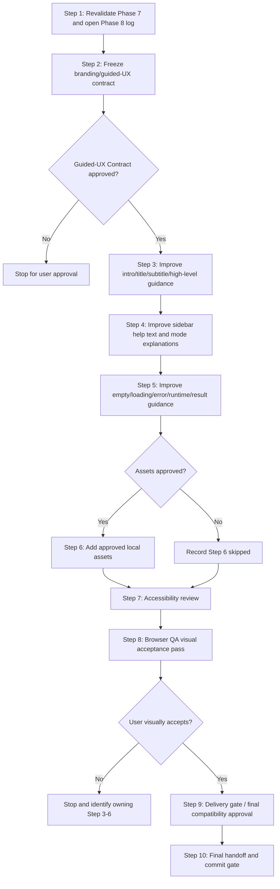

# Phase 8 Blueprint — Streamlit Assets, Branding, and Guided User Experience

Status: Proposed — awaiting Phase 8 Blueprint approval.

Created for repository:

`C:\Users\hatem\OneDrive\Desktop\Project for uri\visualize code\category-tracking`

Latest confirmed baseline:

- Branch: `master`
- Latest pushed commit: `88e9559 feat: polish Streamlit product UI for Phase 7`
- Working tree at Blueprint creation start: clean
- After this Blueprint is created and before it is committed, `plans/phase-8-streamlit-assets-guided-ux.md` may appear as an approved untracked planning artifact. Step 1 must record its byte count and SHA-256 as a known pre-existing Blueprint artifact rather than treating it as unauthorized implementation drift.
- Streamlit remains the primary accepted user-facing frontend.
- Next.js remains deferred / experimental / non-primary.

This Blueprint is a plan-only artifact. It does not authorize implementation until the user approves it.

## 1. Objective

Phase 8 improves the accepted Streamlit app with tasteful branding, optional local images/GIFs/icons, clearer guided explanations, and a more polished user journey while preserving the exact accepted Phase 7 Streamlit chart/data behavior, section order, scientific outputs, compatibility APIs, and one-button workflow.

Phase 8 is a Streamlit product-experience phase. It is not a scientific, backend, API, engine, Next.js, deployment, database, authentication, authorization, persistence, or infrastructure phase.

Primary frontend:

- `category_tracking_web.py`

Deferred frontend:

- `frontend/`

Phase 8 may improve the product experience around the existing app. It must not replace the accepted Streamlit experience.

## 2. Classification and risk

- Type: Streamlit branding, assets, and guided UX.
- Size: medium; expected 10 execution steps.
- Scientific risk: low if touched-file boundaries and preservation rules are honored.
- Acceptance risk: medium to high because branding, assets, and wording are subjective.
- Asset risk: medium if images/GIFs/icons are introduced without source, size, ownership, and accessibility controls.
- Backend/API risk: low; Phase 8 should not touch backend/API files.
- Deployment risk: none; deployment is explicitly out of scope.

## 3. Required context for every implementation step

Every implementation step must read, or explicitly confirm it has already read during the same invocation, the relevant files below before editing.

Governing files:

- `CLAUDE.md`
- `.ai-style-rules.md`
- `README.md`
- `future_enhancement_explained.plan.md`

Phase plans/logs:

- `plans/phase-1-extract-ui-independent-engine.md`
- `plans/phase-1-execution-log.md`
- `plans/phase-2-strengthen-computation.md`
- `plans/phase-2-execution-log.md`
- `plans/phase-3-optimize-computation.md`
- `plans/phase-3-execution-log.md`
- `plans/phase-4-fastapi-backend.md`
- `plans/phase-4-execution-log.md`
- `plans/phase-5-in-process-background-jobs.md`
- `plans/phase-5-execution-log.md`
- `plans/phase-6-nextjs-analysis-workspace.md`
- `plans/phase-6-execution-log.md`
- `plans/phase-7-streamlit-product-polish.md`
- `plans/phase-7-execution-log.md`
- `plans/phase-8-streamlit-assets-guided-ux.md`
- `plans/phase-8-execution-log.md`, after Step 1 creates it

Approved contracts/docs:

- `docs/phase_2_scientific_contract.md`
- `docs/phase_4_api_contract.md`
- `docs/phase_5_job_contract.md`
- `docs/phase_6_frontend_contract.md`
- `docs/phase_7_streamlit_visual_contract.md`
- `docs/phase_8_streamlit_guided_ux_contract.md`, after Step 2 creates it
- `engine/README.md`
- `frontend/README.md`

Accepted primary frontend and compatibility references:

- `category_tracking_web.py`
- `category_tracking.py`
- `diagnose_category_tracking_web.py`
- `tests/test_streamlit_surface.py`
- `tests/test_streamlit_engine_boundary.py`
- `tests/fixtures/phase1_streamlit_surface.json`
- `tests/compat/diagnose_category_tracking_web_phase1_baseline.py`

Current engine/API/test roots:

- `engine/`
- `api/`
- `requirements.txt`
- `tests/`
- `tests/fixtures/`
- `tests/compat/`

Deferred frontend:

- `frontend/`

## 4. Non-goals

Phase 8 must not:

- change scientific calculations;
- change engine algorithms;
- change engine APIs;
- change FastAPI routes;
- change Phase 5 background-job behavior;
- rewrite the app in React/Next.js;
- make Next.js primary;
- create a new frontend framework;
- add deployment, hosting, Docker, Kubernetes, Redis, Celery, RQ, PostgreSQL, database, authentication, authorization, accounts, or external services;
- add dependencies unless a later explicit plan mutation approves them;
- add remote images, remote GIFs, tracking scripts, analytics, or CDN assets;
- regenerate or modify frozen fixtures;
- weaken tests, diagnostics, tolerances, hashes, or contracts;
- hide or remove accepted scientific charts/tables;
- change chart data to make visuals prettier;
- simplify scientific terminology incorrectly;
- start Phase 9.

## 5. Strict preservation contract

Phase 8 must preserve:

- exact chart types;
- chart meanings;
- chart axes;
- chart legends;
- chart ordering;
- chart data;
- table contents;
- table columns;
- section order unless explicitly approved;
- control order unless explicitly approved;
- one-button workflow;
- existing fullscreen behavior;
- exact probability outputs;
- sampled RNG behavior;
- aggregated sampled contract;
- Streamlit primary frontend decision;
- FastAPI behavior;
- Phase 5 job behavior;
- engine APIs;
- frozen diagnostics;
- frozen fixtures;
- compatibility APIs;
- Tkinter compatibility.

Presentation code may transform already-returned rows for display only when the current Streamlit app already does so. It must not calculate new scientific results, denominators, mutation behavior, convergence rules, or simulation outputs.

## 6. Product experience contract

“Guided UX” in Phase 8 means the app should feel easier to understand before and after pressing the existing run/control workflow, without turning into marketing fluff.

Phase 8 may improve:

- first impression;
- app title/subtitle clarity;
- concise high-level intro;
- Configure → Run → Inspect guidance;
- sidebar help text;
- mode explanations;
- “what this mode does” hints;
- empty-state guidance;
- loading/status guidance;
- error guidance;
- result interpretation hints;
- local branding elements;
- local educational or decorative assets after approval;
- README launch/use wording.

Phase 8 copy must:

- remain scientifically honest;
- preserve established terms such as `Sampled copies`, `Exact probability`, `Codon focus`, `Whole population`, `Compare both`, and the accepted category labels;
- clarify without inventing claims;
- avoid overpromising certainty;
- avoid implying sampled output is authoritative when exact probability is the deterministic reference;
- keep charts and tables as the center of the app.

Phase 8 visual guidance must:

- support the scientific workflow;
- keep the app calm and readable;
- avoid clutter;
- avoid asset-heavy layouts;
- avoid moving charts/tables behind decorative content;
- make the existing one-flow behavior clearer.

## 7. Branding and asset policy

Assets are optional and require explicit user approval before addition.

If approved, Phase 8 may create:

- `assets/`
- local PNG/JPG/SVG images;
- local GIFs;
- local icons;
- a small local logo mark;
- local educational visual hints that do not replace scientific charts.

Asset requirements:

- Assets must be local; no remote hotlinks.
- Assets must not require new third-party packages.
- Assets must have recorded source/ownership/license notes.
- Assets must have recorded byte size, dimensions when practical, and SHA-256.
- Large assets require explicit approval before addition.
- GIFs must not flash, distract, or obscure controls/results.
- Assets must not contain secrets, private paths, personal data, or external tracking.
- Assets must not hide, replace, or reinterpret scientific charts/tables.
- Every user-facing informative image needs an accessible text alternative, caption, or nearby explanation.

If assets are not approved, Step 6 is skipped normally and recorded in `plans/phase-8-execution-log.md`.

## 8. Theme policy

Default decision:

- `.streamlit/config.toml` is not approved for edits in Phase 8 unless the Step 2 contract explicitly requests and the user approves theme-file edits.

If theme edits are approved, they may only adjust safe Streamlit visual tokens such as:

- app primary color;
- background/surface color;
- text color;
- border/radius-like supported settings;
- typography settings supported by Streamlit.

Theme edits must not:

- change chart data;
- change chart semantics;
- break contrast;
- cause layout overlap;
- introduce external dependencies;
- require engine/API changes.

## 9. Touched-file boundaries

Allowed across Phase 8 implementation, depending on the step:

- `plans/phase-8-execution-log.md`
- `docs/phase_8_streamlit_guided_ux_contract.md`
- `category_tracking_web.py`
- `tests/test_streamlit_surface.py`
- `README.md`, only for launch/use wording
- `assets/**`, only after explicit asset approval
- `.streamlit/config.toml`, only after explicit theme approval

Prohibited unless a formal plan mutation is approved:

- `engine/**`
- `api/**`
- `frontend/**`
- `requirements.txt`
- `frontend/package.json`
- `frontend/package-lock.json`
- `tests/fixtures/**`
- `diagnose_category_tracking_web.py`
- `tests/compat/diagnose_category_tracking_web_phase1_baseline.py`
- `category_tracking.py`
- prior phase contracts except read-only references
- package files
- deployment/infrastructure files
- Git metadata

## 10. Universal verification baseline

Every implementation step must preserve this baseline from the repository root:

```powershell
$env:PYTHONDONTWRITEBYTECODE='1'
python -m unittest discover -s tests -p "test_streamlit_surface.py" -v
python diagnose_category_tracking_web.py
python -m tests.compat.diagnose_category_tracking_web_phase1_baseline
python -m unittest discover -s tests -p "test_*.py"
python -m unittest discover -s tests -p "test_api_job*.py" -v
python -m unittest discover -s tests -p "test_api_*.py" -v
python -c "import sys, engine; forbidden={'streamlit','tkinter','plotly','PyQt5'}; assert not forbidden.intersection(sys.modules); print('engine-ui-independence-ok')"
```

Also verify:

- frozen fixture hashes unchanged;
- diagnostic hashes unchanged;
- no root runtime imports;
- no forbidden engine imports;
- no `__pycache__`;
- no unexpected generated files;
- Git untouched until commit approval.

Step 1 must create a named `Phase 8 immutable baseline manifest` section in `plans/phase-8-execution-log.md`. Steps 3-10 must compare protected fixtures, diagnostics, dependency files, prior contracts, and other immutable files against that exact manifest rather than against ad hoc current hashes.

Recommended PowerShell hash collection pattern:

```powershell
$paths = @(
  'tests/fixtures/phase1_streamlit_surface.json',
  'tests/fixtures/phase1_scientific_baseline.json',
  'tests/fixtures/phase2_scientific_contract.json',
  'tests/fixtures/phase5_openapi.json',
  'diagnose_category_tracking_web.py',
  'tests/compat/diagnose_category_tracking_web_phase1_baseline.py',
  '.streamlit/config.toml',
  'requirements.txt'
)
foreach ($path in $paths) {
  if (Test-Path -LiteralPath $path) {
    $item = Get-Item -LiteralPath $path
    $hash = (Get-FileHash -LiteralPath $path -Algorithm SHA256).Hash
    Write-Output "$path`t$($item.Length)`t$hash"
  } else {
    Write-Output "$path`tMISSING`tMISSING"
  }
}
```

Implementation prompts must record the pre/post hash table and explicitly state whether every protected hash matched the Step 1 manifest.

## 11. Streamlit browser QA baseline

Phase 8 must include Streamlit browser QA before visual acceptance:

```powershell
$env:PYTHONDONTWRITEBYTECODE='1'
python -m streamlit run category_tracking_web.py --server.address 127.0.0.1 --server.port 8501 --server.headless true
```

Browser QA should verify:

- app loads;
- branding/header appears clean;
- intro guidance is helpful;
- sidebar controls still work;
- one-button workflow remains clear;
- Codon focus works;
- Whole population works;
- Compare both works;
- fullscreen section controls work;
- charts render unchanged;
- tables render unchanged;
- assets, if added, load locally;
- no traceback;
- no unexpected console errors;
- user visually accepts the guided UX.

Browser QA is a supplement to deterministic tests, not the source of truth for chart-data equality. QA notes must record:

- visible section order inspected;
- chart names/headings inspected;
- table headings inspected;
- modes exercised: Codon focus, Whole population, Compare both;
- fullscreen sections exercised;
- confirmation that accepted Phase 7 surface markers still appear.

Chart/table “unchanged” means the deterministic Streamlit surface tests and diagnostics remain green, and browser QA finds no user-visible chart/table drift.

Do not kill unrelated processes. If `127.0.0.1:8501` is occupied, record the conflict and either ask the user or use a recorded alternate local port for that QA run only.

## 12. Accessibility baseline

Phase 8 must preserve or improve:

- keyboard reachability;
- visible focus;
- clear control labels;
- understandable status/loading/error text;
- chart/table headings;
- contrast for text and controls;
- no obvious keyboard traps;
- fullscreen/modal close behavior.

If assets are added:

- informative images/icons need a text alternative, caption, or adjacent context;
- decorative images should not be announced as scientific evidence;
- GIFs must avoid flashing and excessive motion;
- assets must not make keyboard navigation or reading order worse.

## 13. Dependency graph



Serial constraints:

- Steps 1 and 2 are prerequisites for all implementation.
- Steps 3-5 are serial because they share `category_tracking_web.py` and `tests/test_streamlit_surface.py`.
- Step 6 is optional and gated by explicit user asset approval.
- Steps 7-10 are serial final review/gate steps.

Parallelism:

- No implementation steps are recommended for parallel execution because they share the same Streamlit surface and accepted UX. Parallel agents may only perform read-only review if a later prompt explicitly asks for it.

## 14. Step 1 — Revalidate Phase 7 and open Phase 8 execution log

Goal:

Start Phase 8 from a clean, pushed Phase 7 baseline and create the execution log.

Recommended ECC skill:

- `ecc:orch-add-feature`

Context brief:

Phase 7 completed at `88e9559`. Streamlit is accepted. This step records the starting state and proves that Phase 8 begins without implementation drift.

If `plans/phase-8-streamlit-assets-guided-ux.md` is present as an untracked file at Step 1 start, record it as the approved Blueprint artifact with byte count and SHA-256. Do not commit it during Step 1. Any other uncommitted or untracked file requires user direction before proceeding.

Allowed touched files:

- `plans/phase-8-execution-log.md`

Prohibited files:

- all production code, tests, fixtures, contracts, docs other than the execution log, dependency files, engine/API/frontend files, assets, and Git metadata.

Tasks:

1. Confirm branch, latest commit, remote, and working-tree status.
2. Confirm latest commit is `88e9559` or a later approved commit.
3. Confirm `plans/phase-8-streamlit-assets-guided-ux.md` exists and is the approved Blueprint candidate.
4. If the Blueprint is untracked, record it as the approved planning artifact and confirm no other unauthorized working-tree drift exists.
5. Confirm Streamlit remains primary accepted frontend.
6. Confirm Next.js remains deferred / experimental / non-primary.
7. Record UTC timestamp.
8. Create `plans/phase-8-execution-log.md` immediately after baseline status is confirmed.
9. Create the named `Phase 8 immutable baseline manifest` section.
10. Record byte counts and SHA-256 hashes for governing files, prior phase plans/logs, contracts, Streamlit app, tests, diagnostics, fixtures, engine files, API files, README files, dependency files, and `.streamlit/config.toml` if present.
11. Run the universal verification baseline.
12. Record commands, exit codes, diagnostic pass counts, hashes, boundary checks, no-Git-action evidence, and Step 1 exit criteria as they occur.

Verification:

- Universal verification baseline passes.
- Both diagnostics pass 17/17.
- Engine UI-independence check passes.
- No `__pycache__` remains.
- Only the execution log is created or modified during Step 1; the approved Blueprint may remain as a pre-existing planning artifact.

Rollback:

- If the log was newly created and Step 1 must be rolled back, remove only `plans/phase-8-execution-log.md` after validating its exact path.
- Do not touch production files.

Exit criteria:

- Phase 8 log exists.
- Phase 7 baseline is green.
- No Phase 8 implementation code exists.
- Step 2 may begin only after user approval to proceed.

## 15. Step 2 — Freeze the Phase 8 branding/guided-UX contract

Goal:

Create a contract that defines allowed branding, guidance, copy, asset, and theme behavior before editing the Streamlit UI.

Recommended ECC skills:

- `ecc:contract-first`
- `ecc:frontend-design-direction`

Context brief:

Phase 8 is subjective enough that a contract is needed before styling or copy changes. The contract should protect the accepted Phase 7 chart/data experience while allowing product guidance and optional assets.

Allowed touched files:

- `docs/phase_8_streamlit_guided_ux_contract.md`
- `plans/phase-8-execution-log.md`

Prohibited files:

- `category_tracking_web.py`
- tests
- fixtures
- engine/API/frontend files
- assets
- dependencies
- Git metadata

Tasks:

1. Create `docs/phase_8_streamlit_guided_ux_contract.md`.
2. Set status to `Proposed — awaiting Phase 8 Guided UX Contract approval`.
3. Define Streamlit primary frontend authority.
4. Define Next.js deferred/non-primary status.
5. Define guided-UX copy rules.
6. Define branding rules.
7. Define asset policy, including local-only assets and required user approval.
8. Define image/GIF accessibility requirements.
9. Define theme policy and whether `.streamlit/config.toml` is allowed.
10. Define exact chart/data preservation rules.
11. Define prohibited changes and plan-mutation protocol.
12. Run focused verification and append evidence to the execution log.
13. Stop for explicit user approval of the guided-UX contract.

Verification:

- Contract exists.
- Contract is not marked approved by the agent.
- Universal verification baseline remains green or a documented focused no-code verification is recorded.
- Only the contract and execution log changed.

Rollback:

- Restore or remove only `docs/phase_8_streamlit_guided_ux_contract.md` and the execution-log append from backups.

Exit criteria:

- Contract is complete and ready for user approval.
- Step 3 may not begin until the user explicitly approves the contract.

## 16. Step 3 — Improve intro, title/subtitle, and high-level guidance

Goal:

Make the first impression clearer and more guided without changing chart/data behavior or the accepted workflow.

Recommended ECC skills:

- `developing-with-streamlit`
- `ecc:orch-refine-code`

Context brief:

The accepted app already has a polished Phase 7 structure. Step 3 may improve title/subtitle, short intro copy, and Configure → Run → Inspect guidance. It must not add a landing page or hide the working tool.

Allowed touched files:

- `category_tracking_web.py`
- `tests/test_streamlit_surface.py`
- `plans/phase-8-execution-log.md`
- `README.md`, only if a tiny launch/use clarification is approved and necessary

Prohibited files:

- engine/API/frontend files
- fixtures
- diagnostics
- assets
- dependencies
- `.streamlit/config.toml` unless Step 2 explicitly approved theme edits

TDD tasks:

RED:

1. Add or update focused Streamlit surface tests for approved intro/title/guidance markers.
2. Tests must fail for the intended missing guidance, not because of changed scientific behavior.
3. Existing Phase 7 surface assertions must be preserved unless a formal plan mutation is approved. Test edits are additive by default.

GREEN:

1. Update `category_tracking_web.py` minimally.
2. Preserve accepted app title identity unless the contract explicitly approves refinement.
3. Add concise, scientifically honest guidance.
4. Keep the analysis UI immediately visible.
5. Do not add assets in this step.

REFACTOR:

1. Refactor only for readability.
2. Keep tests green.

Verification:

- Focused Streamlit surface tests pass.
- Universal verification baseline passes.
- Diff `tests/test_streamlit_surface.py` and explicitly certify that no existing Phase 7 assertion was deleted, weakened, or relaxed unless separately approved.
- Browser smoke if useful and safe.

Rollback:

- Restore only manifest-listed files from backups.
- Rerun focused tests and the prior completed baseline.

Exit criteria:

- Intro/guidance improvements are present.
- Chart/data behavior is unchanged.
- No asset or dependency was added.

## 17. Step 4 — Improve sidebar help text and mode explanations

Goal:

Reduce confusion around modes and controls while preserving control order, labels, defaults, query bindings, and one-button workflow.

Recommended ECC skills:

- `developing-with-streamlit`
- `ecc:orch-refine-code`

Context brief:

The sidebar is the control cockpit. Phase 8 may clarify what modes mean, but must not reorder controls or split the flow into many buttons.

Allowed touched files:

- `category_tracking_web.py`
- `tests/test_streamlit_surface.py`
- `plans/phase-8-execution-log.md`

Prohibited files:

- engine/API/frontend files
- fixtures
- diagnostics
- assets
- dependencies
- prior phase contracts

TDD tasks:

RED:

1. Add or update focused tests for approved sidebar guidance markers.
2. Preserve existing widget contract expectations.
3. Existing Phase 7 surface assertions must be preserved unless a formal plan mutation is approved. Test edits are additive by default.

GREEN:

1. Add concise help text/tooltips/captions where approved.
2. Clarify `Your probability`, `Preset`, and `Compare both`.
3. Clarify `Sampled copies` versus `Exact probability` without changing terminology.
4. Preserve widget order, keys, defaults, query bindings, and validation behavior.

REFACTOR:

1. Keep copy concise.
2. Avoid broad UI restructure.

Verification:

- Focused Streamlit surface tests pass.
- Universal verification baseline passes.
- Diff `tests/test_streamlit_surface.py` and explicitly certify that no existing Phase 7 assertion was deleted, weakened, or relaxed unless separately approved.

Rollback:

- Restore only touched files from backups and rerun verification.

Exit criteria:

- Sidebar guidance is clearer.
- Control contract is preserved.

## 18. Step 5 — Improve empty states, loading guidance, runtime, and result interpretation copy

Goal:

Make the app more understandable while running and after results appear, without changing result values, tables, or charts.

Recommended ECC skills:

- `developing-with-streamlit`
- `ecc:orch-refine-code`

Context brief:

Step 5 focuses on surrounding text: loading/status, empty-state hints, error guidance, runtime interpretation, and result interpretation captions. It must not add scientific claims not supported by the engine.

Allowed touched files:

- `category_tracking_web.py`
- `tests/test_streamlit_surface.py`
- `plans/phase-8-execution-log.md`

Prohibited files:

- engine/API/frontend files
- fixtures
- diagnostics
- assets unless Step 6 later approves them
- dependencies

TDD tasks:

RED:

1. Add or update focused tests for approved status/empty/error/result guidance markers.
2. Ensure tests do not require changed table/chart contents.
3. Existing Phase 7 surface assertions must be preserved unless a formal plan mutation is approved. Test edits are additive by default.

GREEN:

1. Improve loading/status text.
2. Improve invalid-input guidance only if it preserves validation behavior.
3. Add brief interpretation hints near results without changing scientific meaning.
4. Keep runtime display.
5. Preserve all chart/table data and order.

REFACTOR:

1. Extract small presentation helpers only if useful and within `category_tracking_web.py`.
2. Avoid broad restructure.

Verification:

- Focused Streamlit surface tests pass.
- Universal verification baseline passes.
- Diff `tests/test_streamlit_surface.py` and explicitly certify that no existing Phase 7 assertion was deleted, weakened, or relaxed unless separately approved.

Rollback:

- Restore touched files from backups and rerun verification.

Exit criteria:

- Guidance is clearer.
- No scientific wording drift or chart/table changes occurred.

## 19. Step 6 — Add approved local logo/icon/images/GIFs, if approved

Goal:

Add local assets only if the user explicitly approves the asset set.

Recommended ECC skills:

- `developing-with-streamlit`
- `ecc:frontend-design-direction`

Context brief:

Assets are optional. A clean product may benefit from a small local logo/icon or tasteful educational image, but assets can also clutter scientific software. This step is skipped unless the user approves it.

Asset Gate:

- Default early decision before Step 3: assets are deferred unless the user says they want to discuss them immediately.
- Required Step 6 decision: before Step 6 starts, ask the user whether assets should be added now.
- If the user declines or defers assets, record Step 6 as skipped and proceed to Step 7.
- If the user approves assets, record the exact asset list and allowed purpose before adding anything.

Allowed touched files if assets are approved:

- `assets/**`
- `category_tracking_web.py`
- `tests/test_streamlit_surface.py`
- `README.md`, only for necessary attribution or launch/use wording
- `plans/phase-8-execution-log.md`

Prohibited files:

- engine/API/frontend files
- fixtures
- diagnostics
- dependencies
- remote asset references

Tasks if assets are approved:

1. Record user approval and asset scope.
2. Add only local assets under `assets/**`.
3. Record source, ownership/license, byte size, dimensions when practical, and SHA-256.
4. Use assets decoratively or educationally only.
5. Ensure assets do not obscure controls, charts, or tables.
6. Add accessible text alternatives/captions/context.
7. Add focused Streamlit surface tests for asset presence and local-path behavior where practical.
8. Run verification and browser QA.

Verification:

- Focused Streamlit surface tests pass.
- Universal verification baseline passes.
- Browser QA confirms assets load locally.
- No remote asset requests or tracking scripts are introduced.

Rollback:

- Remove only exact newly created assets after validating paths are under `assets/**`.
- Restore manifest-listed files from backups.
- Rerun verification.

Exit criteria:

- Assets are either approved and verified, or Step 6 is cleanly skipped.

## 20. Step 7 — Accessibility review and in-scope remediation for new copy/assets and visual affordances

Goal:

Verify Phase 8 copy, guidance, and optional assets remain accessible.

Recommended ECC skill:

- `ecc:accessibility`

Context brief:

Accessibility review should happen after Steps 3-6 implementation writes stop. Findings are recorded first. If findings are in-scope and safe, Step 7 may perform narrow remediation. If remediation requires chart/data changes, dependencies, theme mutation, prohibited files, or widened scope, stop for approval.

Allowed touched files:

- `category_tracking_web.py`
- `tests/test_streamlit_surface.py`
- `plans/phase-8-execution-log.md`
- `assets/**`, only if Step 6 already approved assets and the fix touches those assets

Prohibited files:

- engine/API/frontend files
- fixtures
- diagnostics
- dependencies
- prior phase contracts

Tasks:

1. Run accessibility review using the approved contract as the lens.
2. Check keyboard reachability.
3. Check focus visibility.
4. Check labels, captions, and status/error text.
5. Check contrast.
6. Check image/icon/GIF text alternatives if assets exist.
7. Check fullscreen/modal usability.
8. Classify findings as CRITICAL, HIGH, MEDIUM, or LOW.
9. Record findings before any remediation.
10. Fix only in-scope accessibility issues that do not require new approval.
11. Preserve existing Phase 7 surface assertions unless a formal plan mutation is approved. Test edits are additive by default.
12. Append findings, remediation, and evidence to the execution log.

Verification:

- Focused Streamlit surface tests pass.
- Universal verification baseline passes.
- Accessibility findings have owner and disposition.
- Diff `tests/test_streamlit_surface.py` and explicitly certify that no existing Phase 7 assertion was deleted, weakened, or relaxed unless separately approved.

Rollback:

- Restore only files changed by accessibility fixes.
- Rerun verification.

Exit criteria:

- No unresolved CRITICAL or HIGH accessibility findings remain.
- MEDIUM/LOW findings are either fixed or explicitly deferred with rationale.

## 21. Step 8 — Browser QA visual acceptance pass

Goal:

Have the live Streamlit app inspected after Phase 8 guided-UX/asset work.

Recommended ECC skill:

- `ecc:browser-qa`

Context brief:

This is the visual acceptance checkpoint. Tests can prove structure, but the user must decide whether the product experience feels right.

Allowed touched files:

- `plans/phase-8-execution-log.md`

No production code may be modified during Step 8 unless the user separately approves reopening an owning implementation step.

Tasks:

1. Check whether `127.0.0.1:8501` is already in use.
2. Start Streamlit locally if safe.
3. Inspect initial load, branding/header, intro guidance, sidebar, one-button workflow, Codon focus, Whole population, Compare both, fullscreen sections, charts, tables, assets if present, invalid input/error state, runtime/status display, and console output.
4. Record concrete visual evidence notes.
5. Stop Streamlit cleanly unless the user asks to keep it running.
6. Ask the user for visual acceptance.
7. Record exact user acceptance or requested changes.

Verification:

- Browser QA completed or exact reason recorded.
- No traceback or visible app failure.
- User either accepts the result or findings are recorded with owning steps.
- Browser QA evidence includes section order, chart headings, table headings, mode coverage, fullscreen coverage, and preserved Phase 7 markers.

Rollback:

- Step 8 should not edit production files. If a log-only rollback is required, revert only the Step 8 log append.

Exit criteria:

- User visually accepts the guided UX, or the workflow stops with requested changes and owning steps.

## 22. Step 9 — Delivery gate / final compatibility approval

Goal:

Prove Phase 8 preserved scientific, compatibility, backend, fixture, and accepted Streamlit behavior after product-experience changes.

Recommended ECC skill:

- `ecc:delivery-gate`

Context brief:

This is an approval gate, not an implementation step. If a blocker appears, record it and request approval to reopen the owning Phase 8 step.

Allowed touched files:

- `plans/phase-8-execution-log.md`

Prohibited files:

- all production code, tests, fixtures, contracts, docs other than the execution log, dependencies, assets, engine/API/frontend files, and Git metadata.

Tasks:

1. Confirm Steps 1-8 are complete or Step 6 was properly skipped.
2. Confirm user visual acceptance is recorded.
3. Record UTC timestamp and read-only Git status.
4. Run the universal verification baseline.
5. Verify fixture and diagnostic hashes unchanged.
6. Verify no root runtime imports.
7. Verify no forbidden engine imports.
8. Verify no `__pycache__` or unexpected generated files remain.
9. Verify assets, if any, are local and recorded.
10. Verify no scientific/chart/table/control behavior drift occurred.
11. Record delivery-gate deterministic checks, including disk-space status.
12. Append final Step 9 evidence to the execution log.
13. Stop and ask for Step 10 final handoff approval.

Verification:

- Universal verification baseline passes.
- Both diagnostics pass 17/17.
- Engine UI-independence check passes.
- No unresolved CRITICAL or HIGH findings remain.

Rollback:

- Step 9 should be log-only. If it discovers a blocker, stop and request approval to reopen the owning step rather than fixing it.

Exit criteria:

- Phase 8 is ready for Step 10 final handoff.
- No commit/push has occurred.
- Phase 9 has not started.

## 23. Step 10 — Final handoff and commit gate

Goal:

Complete final evidence, summarize the Phase 8 guided-UX outcome, and stop for commit/push approval.

Recommended ECC skill:

- `ecc:delivery-gate`

Context brief:

Step 10 is the final handoff. It does not implement fixes. It records the final state and recommends a commit message.

Allowed touched files:

- `plans/phase-8-execution-log.md`

Prohibited files:

- all production code, tests, fixtures, contracts, docs other than the execution log, dependencies, assets, engine/API/frontend files, and Git metadata.

Tasks:

1. Confirm Step 9 passed and is recorded.
2. Confirm the user approved Step 10 final handoff.
3. Record UTC timestamp and read-only Git status.
4. Run final verification or confirm Step 9 verification is still current according to the approved prompt.
5. Record final visual handoff summary.
6. Record final boundary/security evidence.
7. Record final immutable hashes.
8. Record remaining LOW findings and dispositions.
9. Record final touched-file manifest.
10. Confirm no Phase 9 work started.
11. Confirm no Git action occurred.
12. Recommend commit message.
13. Stop for explicit commit/push approval.

Verification:

- Final baseline passes.
- No unresolved CRITICAL or HIGH findings remain.
- Working tree contains only approved Phase 8 files.

Rollback:

- Step 10 should be log-only. Roll back only the Step 10 log append if needed.

Exit criteria:

- Phase 8 is ready to commit.
- Recommended commit message is provided.
- No commit/push has occurred.

## 24. Approval gates

1. Blueprint approval gate:
   - User approves `plans/phase-8-streamlit-assets-guided-ux.md` before Step 1 implementation.
2. Guided-UX contract approval gate:
   - User approves `docs/phase_8_streamlit_guided_ux_contract.md` before Step 3.
3. Asset approval gate:
   - User explicitly approves or declines local images/GIFs/icons before Step 6.
4. Browser visual acceptance gate:
   - User visually accepts the live Streamlit app after Step 8 before Step 9.
5. Final handoff approval gate:
   - User approves Step 10 final handoff after Step 9 passes.
6. Commit/push approval gate:
   - User approves commit/push after Step 10, unless the user has separately granted standing push authorization for this phase.

## 25. Recommended ECC skill order

| Step | Skills | Purpose |
| --- | --- | --- |
| 1 | `ecc:orch-add-feature` | Revalidate Phase 7 and open the Phase 8 execution log. |
| 2 | `ecc:contract-first` + `ecc:frontend-design-direction` | Freeze guided-UX, branding, asset, copy, and theme contract before UI edits. |
| 3 | `developing-with-streamlit` + `ecc:orch-refine-code` | Improve intro/title/subtitle/high-level guidance. |
| 4 | `developing-with-streamlit` + `ecc:orch-refine-code` | Improve sidebar help text and mode explanations. |
| 5 | `developing-with-streamlit` + `ecc:orch-refine-code` | Improve empty/loading/error/runtime/result interpretation copy. |
| 6 | `developing-with-streamlit` + `ecc:frontend-design-direction` | Add approved local assets only if explicitly approved; otherwise record a normal skip. |
| 7 | `ecc:accessibility` | Review new copy/assets/visual affordances. |
| 8 | `ecc:browser-qa` | Run live Streamlit visual acceptance QA. |
| 9 | `ecc:delivery-gate` | Final compatibility approval gate. |
| 10 | `ecc:delivery-gate` | Final handoff and commit gate. |

## 26. Anti-pattern catalog

Do not:

- turn guided UX into a marketing landing page before the tool;
- add decorative content that pushes charts/tables down unnecessarily;
- add remote images, scripts, trackers, analytics, or CDNs;
- add unlicensed or unattributed assets;
- use GIFs that distract from analysis or flash;
- rewrite accepted Streamlit charts;
- hide accepted scientific tables;
- change chart data, axes, traces, legends, or order;
- change scientific names to friendlier but inaccurate labels;
- split the one-button workflow into many experiment buttons;
- change engine/API/backend behavior for a UI polish task;
- make Next.js primary again;
- add deployment/infrastructure work;
- weaken Streamlit surface tests to fit new copy;
- regenerate frozen fixtures;
- treat browser visual acceptance as optional.

## 27. Plan mutation protocol

If a requested improvement requires any of the following, stop before editing:

- changing chart type/data/axes/legends/order;
- changing scientific wording materially;
- adding a dependency;
- adding remote assets;
- editing `.streamlit/config.toml` without prior theme approval;
- changing engine/API/background-job behavior;
- modifying frozen fixtures or diagnostics;
- making Next.js primary;
- adding deployment/auth/database/external services;
- widening beyond Phase 8.

Mutation steps:

1. Record the conflict in `plans/phase-8-execution-log.md`.
2. Identify affected files, contracts, and user-visible behavior.
3. Propose the smallest contract/Blueprint mutation.
4. Explain verification and rollback impact.
5. Request explicit user approval.
6. Do not implement until approval is given.

## 28. Rollback protocol

Before every write step:

1. Record exact touched-file manifest.
2. Record byte counts and SHA-256 hashes.
3. Create a unique OS-temporary backup directory.
4. Back up every touched existing file.
5. Record literal backup paths in the execution log.

If rollback is needed:

1. Restore only manifest-listed files from backups.
2. Remove only exact newly created files/assets after validating resolved paths are inside the repository.
3. Never recursively delete a broad directory.
4. Rerun the prior completed verification baseline.
5. Record rollback evidence.
6. Stop and report the blocker.

## 29. Unresolved decisions requiring user approval

Before implementation:

1. Approve or reject this Phase 8 Blueprint.
2. Approve or revise the Step 2 guided-UX contract after it is drafted.
3. Accept the default early decision that assets are deferred unless the user wants to discuss them before Step 3.
4. At Step 6, decide whether Phase 8 may add assets.
5. If assets are allowed, approve the exact asset set before addition.
6. Decide whether `.streamlit/config.toml` may be touched for theme-level polish.
7. Decide whether README launch/use wording may be updated if needed.
8. Visually accept the app after browser QA.
9. Approve final commit/push.

Default recommendations:

- Approve the Blueprint first.
- In Step 2, keep theme edits disabled by default.
- Treat assets as optional; if added, keep them small, local, and minimal.
- Preserve charts/tables exactly.

## 30. Completion definition

Phase 8 is complete when:

- guided-UX contract is approved;
- approved copy/branding improvements are implemented;
- assets are either explicitly approved and verified or cleanly skipped;
- accessibility review passes with no unresolved CRITICAL/HIGH findings;
- browser QA passes;
- user visually accepts the guided UX;
- delivery gate passes;
- final handoff is complete;
- no scientific, chart/data, fixture, diagnostic, engine, API, job, or compatibility regression occurred;
- no Phase 9 work has started;
- changes are committed/pushed only after explicit approval.
